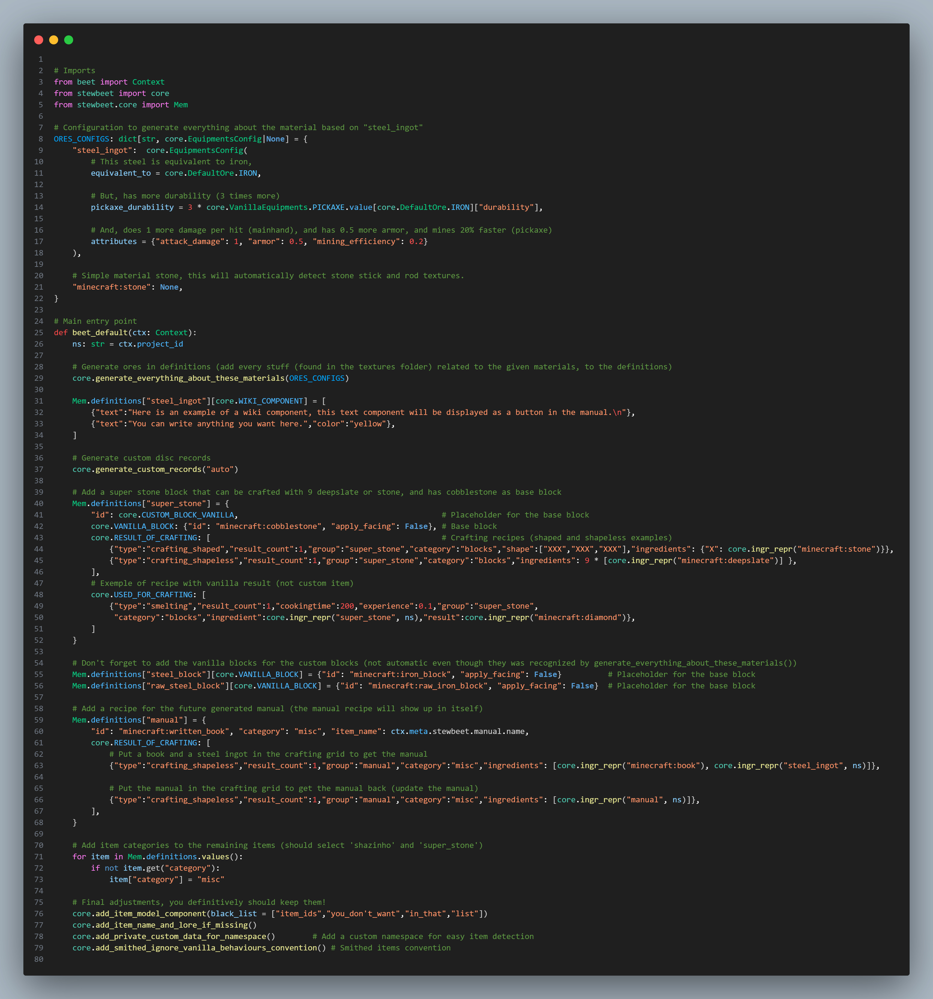

# 🔧 StewBeet Item Definitions Setup

📄 **Example File**: [extensive/src/setup_definitions.py](../templates/extensive/src/setup_definitions.py) 🔗<br>
📄 **Real-world Example**: [SimplEnergy/src/definitions/setup_main.py](https://github.com/Stoupy51/SimplEnergy/blob/main/src/definitions/setup_main.py) 🔗<br>

## 🔗 Dependencies
- **✅ Required**: StewBeet framework core (`from stewbeet.core import *`)
- **✅ Required**: Beet context (`from beet import Context`)
- **📍 Position**: Must be called early in the pipeline before other plugins that depend on definitions
- **🔄 Integration**: Works with all StewBeet plugins that process item definitions

## 📋 Overview
Item definitions are the heart of the StewBeet framework. They define custom items, blocks, equipment, <br>
recipes, and their properties in a unified system. The definitions setup creates a comprehensive<br>
database of all custom content that subsequent plugins use to generate datapacks and resource packs.<br>
**(This is typically the first user-created plugin in the pipeline after `stewbeet.plugins.initialize`.)**

### <u>Some Features Showcase</u>

**Item definitions from the Extensive Template (don't be scared plz):**<br>


## 🎯 Purpose
- 🛠️ Define custom items, blocks, and equipment with properties
- ⚙️ Configure automatic material generation (ores, ingots, tools, armor)
- 📦 Set up crafting recipes (shaped, shapeless, smelting, etc.)
- 🔗 Establish relationships between items and their uses
- 🏷️ Configure item names, lore, and categories
- 🎨 Link items to their texture and model assets (if necessary)

## ⚙️ Configuration

### 🎯 Basic Example Setup
```python
from beet import Context
from stewbeet import core
from stewbeet.core import Mem

def beet_default(ctx: Context):
    ns: str = ctx.project_id
    
    # Your definitions here...
    
    # Final adjustments (keep these!)
    core.add_item_model_component()
    core.add_item_name_and_lore_if_missing()
    core.add_private_custom_data_for_namespace()
    core.add_smithed_ignore_vanilla_behaviours_convention()
```

## 📚 Core Concepts

### 🔩 The Mem.definitions Database
All item definitions are stored in `Mem.definitions`, a global dictionary where:
- **Key**: Item ID (string)
- **Value**: Item definition dictionary with properties

```python
Mem.definitions["my_item"] = {
    "id": "minecraft:iron_ingot",           # Base Minecraft item
    core.CATEGORY: "materials",             # StewBeet category for the manual
    "item_name": "My Custom Item",          # Minecraft component
    # ... other properties
}
```

### 🏗️ Essential Definition Components

#### **🔧 Special StewBeet Properties**
| Component | Type | Description |
|-----------|------|-------------|
| `"id"` | string | **Required**: Base Minecraft item ID (e.g., `"minecraft:iron_ingot"`). Recommed is `core.CUSTOM_ITEM_VANILLA` |
| `core.CATEGORY` | string | StewBeet organization category for the manual (`"materials"`, `"tools"`, `"blocks"`, etc.) |
| `core.VANILLA_BLOCK` | dict | For custom blocks: base block configuration |
| `core.RESULT_OF_CRAFTING` | list | Recipes that create this item |
| `core.USED_FOR_CRAFTING` | list | Recipes that use this item as ingredient |
| `core.WIKI_COMPONENT` | list | Manual/wiki text components |

#### **⚙️ Minecraft Item Components**
**Important**: All other properties are standard [Minecraft item components](https://minecraft.wiki/w/Item_component) (without `minecraft:` prefix):

| Component | Type | Description |
|-----------|------|-------------|
| `"item_name"` | string/dict | Item display name or text component |
| `"lore"` | list | Lore lines (list of text components) |
| `"max_damage"` | int | Item durability (for tools, armor) |
| `"container"` | list | Container slots (for shulker boxes, bundles) |
| `"unbreakable"` | dict | Makes item unbreakable |
| `"enchantments"` | dict | Item enchantments (`{"levels": {"minecraft:sharpness": 5}}`) |
| `"attribute_modifiers"` | dict | Equipment attribute modifiers |
| `"food"` | dict | Food properties (`{"nutrition": 4, "saturation": 2.4}`) |
| `"tool"` | dict | Tool properties and block breaking rules |
| `"custom_data"` | dict | NBT data for detection and functionality |
| ... | ... | Any other [Minecraft item component](https://minecraft.wiki/w/Item_component) |

**💡 Example with Minecraft components:**
```python
Mem.definitions["magic_sword"] = {
    "id": "minecraft:iron_sword",                               # Base item
    core.CATEGORY: "combat",                                    # StewBeet category
    "item_name": {"text": "Magic Sword", "color": "gold"},      # minecraft:item_name
    "lore": [                                                   # minecraft:lore
        {"text": "A mystical blade", "color": "gray"},
        {"text": "Deals extra damage", "color": "red"}
    ],
    "max_damage": 500,                                          # minecraft:max_damage
    "enchantments": {"levels": {"minecraft:sharpness": 5}},     # minecraft:enchantments
    "attribute_modifiers": [                                    # minecraft:attribute_modifiers
        {
            "type": "minecraft:attack_damage",
            "amount": 8,
            "operation": "add_value",
            "slot": "mainhand",
            "id": "minecraft:base_attack_damage"
        },
        {
            "type": "minecraft:attack_speed",
            "amount": -2.4,
            "operation": "add_value",
            "slot": "mainhand",
            "id": "minecraft:base_attack_speed"
        }
    ]
}
```

## 🛠️ Material Generation

### ⚒️ Automatic Equipment Generation
Generate complete material sets (tools, armor, blocks) automatically:

```python
ORES_CONFIGS: dict[str, core.EquipmentsConfig|None] = {
    "steel_ingot": core.EquipmentsConfig(
        # This steel is equivalent to iron,
        equivalent_to = core.DefaultOre.IRON,

        # But, has more durability (3 times more)
        pickaxe_durability = 3 * core.VanillaEquipments.PICKAXE.value[core.DefaultOre.IRON]["durability"],

        # And, does 1 more damage per hit (mainhand), and has 0.5 more armor, and mines 20% faster (pickaxe)
        attributes = {"attack_damage": 1, "armor": 0.5, "mining_efficiency": 0.2}
    ),
    "minecraft:stone": None,  # Auto-detect from textures
}

# Generate everything (ingots, blocks, tools, armor, ores, materials, etc.)
core.generate_everything_about_these_materials(ORES_CONFIGS)
```

### 🧪 Dust Processing Configuration
Set up automatic pulverizer/furnace recipes for ores:

```python
DUSTS_CONFIGS: dict[str, tuple[list[str|dict], dict]] = {
    "copper": (
        ["raw_copper", "copper_ore", "deepslate_copper_ore"],    # Input items
        core.ingr_repr("minecraft:copper_ingot")                 # Output item
    ),
    "tin": (
        [core.ingr_repr(x, "mechanization") for x in ["raw_tin", "tin_ore"]],
        core.ingr_repr("tin_ingot", "mechanization")
    ),
}

core.add_recipes_for_all_dusts(DUSTS_CONFIGS)
```

## 🏗️ Custom Blocks

### 🧱 Basic Block Definition
```python
Mem.definitions["super_stone"] = {
    "id": core.CUSTOM_BLOCK_VANILLA,                            # Marks as custom block
    core.VANILLA_BLOCK: {                                       # Base block properties
        "id": "minecraft:cobblestone", 
        "apply_facing": False
    },
    core.CATEGORY: "blocks",
    core.RESULT_OF_CRAFTING: [                                  # How to craft it
        {
            "type": "crafting_shaped",
            "result_count": 1,
            "shape": ["XXX", "XXX", "XXX"],
            "ingredients": {"X": core.ingr_repr("minecraft:stone")}
        }
    ]
}
```

### 🔗 Equipment Block Configuration
For blocks generated by `generate_everything_about_these_materials()`, configure their base blocks:

```python
# After generate_everything_about_these_materials()
Mem.definitions["steel_block"][core.VANILLA_BLOCK] = {
    "id": "minecraft:iron_block", 
    "apply_facing": False
}
Mem.definitions["raw_steel_block"][core.VANILLA_BLOCK] = {
    "id": "minecraft:raw_iron_block", 
    "apply_facing": False
}
```

## 🍳 Recipe Configuration

### 📋 Recipe Types and Structure

All recipe definitions follow standard Minecraft recipe JSON structure (same as vanilla recipes):

#### **⚔️ Shaped Crafting Recipe**
```python
{
    "type": "crafting_shaped",
    "result_count": 1,
    "group": "my_group",                    # Recipe book grouping
    "category": "tools",                    # Recipe book category
    "shape": ["X X", " Y ", "X X"],         # 3x3 grid pattern
    "ingredients": {
        "X": core.ingr_repr("minecraft:iron_ingot"),
        "Y": core.ingr_repr("minecraft:stick")
    }
}
```

#### **🎯 Shapeless Crafting Recipe**
```python
{
    "type": "crafting_shapeless",
    "result_count": 4,
    "group": "planks",
    "category": "building_blocks",
    "ingredients": [core.ingr_repr("minecraft:oak_log")]
}
```

#### **🔥 Smelting Recipe**
```python
{
    "type": "smelting",
    "result_count": 1,
    "cookingtime": 200,     # Ticks (200 = 10 seconds)
    "experience": 0.7,
    "group": "iron_ingot",
    "category": "misc",
    "ingredient": core.ingr_repr("minecraft:iron_ore"),
    "result": core.ingr_repr("minecraft:iron_ingot")
}
```

**📝 Note**: These are standard Minecraft recipe definitions - you can use any valid recipe type (`blasting`, `smoking`, `campfire_cooking`, `stonecutting`, `smithing_trim`, `smithing_transform`, etc.) with their respective properties.

### 🔄 Recipe Integration
```python
# Recipes that CREATE this item
Mem.definitions["my_item"][core.RESULT_OF_CRAFTING] = [recipe1, recipe2]

# Recipes that USE this item as ingredient
Mem.definitions["my_item"][core.USED_FOR_CRAFTING] = [recipe3, recipe4]
```

## 📖 Documentation Integration

### 📝 Manual/Wiki Components
Add interactive documentation for the in-game manual:

```python
Mem.definitions["steel_ingot"][core.WIKI_COMPONENT] = [
    {"text": "Steel is a stronger variant of iron.\n"},
    {"text": "It provides better durability and damage.", "color": "yellow"},
    {"text": "\n\nCrafting: Smelt raw steal even though it's not real-world-accurate", "color": "gray"}
]
```

### 📚 Special Items
```python
# Manual item definition (if you want to add a custom recipe for it)
Mem.definitions["manual"] = {
    "id": "minecraft:written_book",
    core.CATEGORY: "misc",
    "item_name": ctx.meta.stewbeet.manual.name,
    core.RESULT_OF_CRAFTING: [
        {
            "type": "crafting_shapeless",
            "result_count": 1,
            "ingredients": [
                core.ingr_repr("minecraft:book"), 
                core.ingr_repr("steel_ingot", ns)
            ]
        }
    ]
}
```

## 🎵 Audio Content

### 🎶 Custom Music Discs
```python
# Auto-generate records from audio files in assets/records/ 🎵
core.generate_custom_records("auto")

# Or specify custom records (pain imo) 😅
core.generate_custom_records({
    "my_disc": "My Custom Music",           # file: assets/records/my_disc.ogg
    "battle_theme": "Epic Battle Music"     # file: assets/records/battle_theme.ogg
})
```

## 🔧 Utility Functions

### 🧰 Essential Helper Functions

#### **📝 Ingredient Representation**
```python
# Local namespace item 🏠
core.ingr_repr("steel_ingot", ns)
# Result: {"custom_data": {"_your_namespace": {"steel_ingot": true}}}

# Minecraft item ⛏️
core.ingr_repr("minecraft:iron_ingot")
# Result: {"id": "minecraft:iron_ingot"}

# External datapack item 📦
core.ingr_repr("tin_ingot", "mechanization")
# Result: {"custom_data": {"mechanization": {"tin_ingot": true}}}
```

#### **🏁 Final Processing Functions**
```python
# Generate item models for all defined items 🎨
core.add_item_model_component(black_list=["some_cable_items_from_simplenergy", "my_special_items"])

# Add default names and lore where missing 📝
core.add_item_name_and_lore_if_missing()

# Add namespace detection data (You really shouldn't remove this!) 🚫
core.add_private_custom_data_for_namespace()

# Add Smithed convention data ⚡
core.add_smithed_ignore_vanilla_behaviours_convention()
```

## 📋 Configuration Options

### 🎯 Equipment Configuration Properties

| Property | Type | Description |
|----------|------|-------------|
| `equivalent_to` | `DefaultOre` | Base material properties (WOOD, STONE, GOLD, IRON, DIAMOND, NETHERITE) |
| `pickaxe_durability` | int | Custom durability override (will be used to compute a multiplication factor for remaining stuff even though you don't want a pickaxe) |
| `attributes` | dict | Attribute modifiers (`attack_damage`, `armor`, `mining_efficiency`) |

### 🏷️ Most Common Item Categories (examples)

| Category | Description |
|----------|-------------|
| `"material"` | Raw materials, ingots, gems |
| `"equipment"` | Pickaxes, swords, shovels, helmets, chestplates, leggings, boots, etc. |
| `"block"` | Building blocks, decorative blocks |
| `"misc"` | Other items, special items |
| `"food"` | Consumable items |
| `"combat"` | Weapons, arrows, shields |

### ⚙️ Special Constants

📄 **Source Code**: [stewbeet/core/constants.py](../../python_package/stewbeet/core/constants.py) 🔗

| Constant | Usage |
|----------|-------|
| `core.CATEGORY` | StewBeet organization category for the manual |
| `core.CUSTOM_BLOCK_VANILLA` | Mark item as custom block placeholder (uses `minecraft:furnace`) |
| `core.CUSTOM_BLOCK_ALTERNATIVE` | Alternative custom block for walls/player position (uses `minecraft:item_frame`) |
| `core.CUSTOM_BLOCK_HEAD` | Custom block without custom model data (uses `minecraft:player_head`) |
| `core.CUSTOM_ITEM_VANILLA` | Base for custom items without survival behavior (uses `minecraft:command_block`) |
| `core.VANILLA_BLOCK` | Define base block for custom blocks |
| `core.NO_SILK_TOUCH_DROP` | Item that drops when silk touch is not used |
| `core.OVERRIDE_MODEL` | Override the entire model with custom data |
| `core.PULVERIZING` | Recipe type for SimplEnergy pulverizer (`"simplenergy_pulverizing"`) |
| `core.SMITHED_CRAFTER_COMMAND` | Custom command for Smithed Crafter recipes |
| `core.WIKI_COMPONENT` | Manual/wiki documentation text components |
| `core.RESULT_OF_CRAFTING` | Recipes that create this item |
| `core.USED_FOR_CRAFTING` | Recipes that use this item as ingredient |
| `core.NOT_COMPONENTS` | List of keys that should not be considered as Minecraft components |

## ✨ Advanced Features

### 🎨 Texture Integration
See [Resource Pack Item Models](./plugins/resource_pack.item_models.md) for automatic texture detection and model generation.
```python
# Items automatically detect textures by name:
# steel_ingot.png -> steel_ingot item
# steel_pickaxe.png -> steel_pickaxe tool
# steel_block.png -> steel_block custom block
```

## 🚨 Best Practices

### ✅ Do's
- Always call final adjustment functions at the end
- Use meaningful category names for organization
- Provide wiki components for complex items
- Use `core.ingr_repr()` for all ingredient references
- Keep item IDs consistent with texture file names

### ❌ Don'ts
- Don't modify `Mem.definitions` after item definitions verification (in another plugin)
- Don't use raw dictionaries for ingredients (use `ingr_repr()`)

### 🎯 Example Complete Setup
```python
def beet_default(ctx: Context):
    ns: str = ctx.project_id
      # 1. Generate materials ⚒️
    core.generate_everything_about_these_materials(ORES_CONFIGS)
    
    # 2. Add dust processing 🧪
    core.add_recipes_for_all_dusts(DUSTS_CONFIGS)
    
    # 3. Configure custom blocks 🧱
    setup_custom_blocks(ns)
    
    # 4. Add special items 📚
    create_manual_item(ctx, ns)

    # 5. Set missing categories if you were lazy 😴
    # (This is not recommended, but can be useful for quick setups)
    for item in Mem.definitions.values():
        if not item.get(core.CATEGORY):
            item[core.CATEGORY] = "misc"
    
    # 6. Final adjustments (REQUIRED!) 🏁
    core.add_item_model_component()
    core.add_item_name_and_lore_if_missing()
    core.add_private_custom_data_for_namespace()
    core.add_smithed_ignore_vanilla_behaviours_convention()
```

**🎉 This comprehensive setup creates a complete item definition system that integrates seamlessly with all StewBeet plugins!**<br>
But again, check some real-world examples (top of this page) to see how it works in practice!<br>
Feel free to adapt and extend it for your own projects! 🚀

