## 🍲 StewBeet plugins 🌱

Last updated: 2025/06/16

Here are all the available plugins for the StewBeet framework:

| Category | Plugin | Description | Image | Dependency |
|----------|--------|-------------|-------|------------|
| 🚀 **Core** | [`stewbeet.plugins.initialize`](./initialize.md) | Initializes StewBeet framework, sets up project metadata and pack configurations |  | 🔴 Fully dependent |
| ✅ **Core** | [`stewbeet.plugins.verify_definitions`](./verify_definitions.md) | Validates item definitions structure and performs consistency checks | 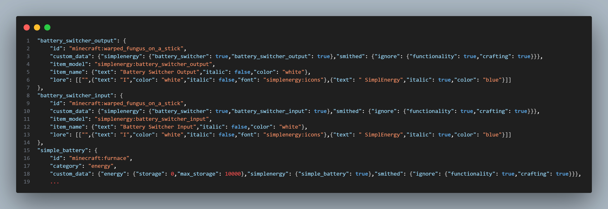 | 🔴 Fully dependent |
| 🔊 **Resource Pack** | [`stewbeet.plugins.resource_pack.sounds`](./resource_pack.sounds.md) | Processes sound files and generates sounds.json from sounds folder | 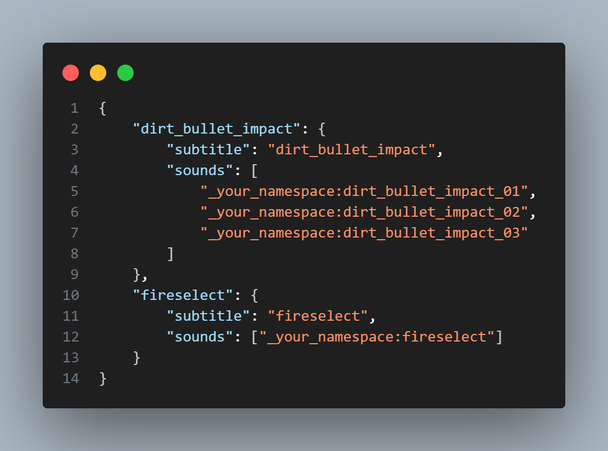 | 🟡 Partly dependent |
| 🎨 **Resource Pack** | [`stewbeet.plugins.resource_pack.item_models`](./resource_pack.item_models.md) | Automatically generates item models from texture patterns | 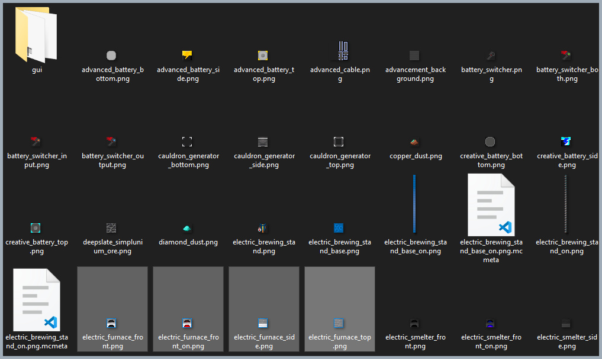 | 🟡 Partly dependent |
| 🖼️ **Resource Pack** | [`stewbeet.plugins.resource_pack.check_power_of_2`](./resource_pack.check_power_of_2.md) | Validates that textures use power-of-2 resolutions |  | 🟢 Independent |
| 🍳 **Recipes** | [`stewbeet.plugins.custom_recipes`](./custom_recipes.md) | Generates vanilla, smithed, furnace and pulverizer recipes for items |  | 🔴 Fully dependent |
| 📖 **Documentation** | [`stewbeet.plugins.ingame_manual`](./ingame_manual.md) | Creates interactive in-game manual with item documentation and recipes |  | 🔴 Fully dependent |
| ⚡ **Datapack** | [`stewbeet.plugins.datapack.loading`](./datapack.loading.md) | Sets up datapack loading system with version checking and dependencies |  | 🟡 Partly dependent |
| 🧱 **Datapack** | [`stewbeet.plugins.datapack.custom_blocks`](./datapack.custom_blocks.md) | Implements custom block placement, destruction and interaction systems |  | 🔴 Fully dependent |
| 🎁 **Datapack** | [`stewbeet.plugins.datapack.loot_tables`](./datapack.loot_tables.md) | Generates loot tables for all items and creates give-all functionality |  | 🔴 Fully dependent |
| 📦 **Compatibility** | [`stewbeet.plugins.compatibilities.simpledrawer`](./compatibilities.simpledrawer.md) | Adds SimpleDrawer material compatibility for compacted drawers | 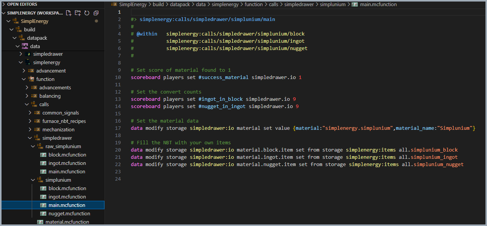 | 🔴 Fully dependent |
| ⚔️ **Compatibility** | [`stewbeet.plugins.compatibilities.neo_enchant`](./compatibilities.neo_enchant.md) | Provides NeoEnchant veinminer compatibility for custom ores | 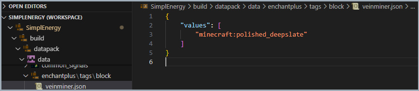 | 🔴 Fully dependent |
| ⏰ **Finalization** | [`stewbeet.plugins.finalyze.custom_blocks_ticking`](./finalyze.custom_blocks_ticking.md) | Sets up custom block ticking and update systems | 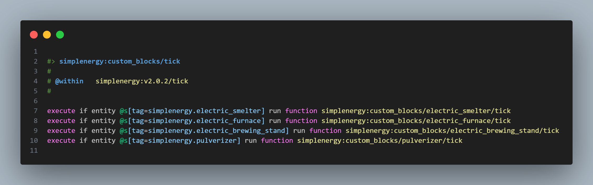 | 🔴 Fully dependent |
| 🏗️ **Finalization** | [`stewbeet.plugins.finalyze.basic_datapack_structure`](./finalyze.basic_datapack_structure.md) | Creates basic datapack timing structure (tick, second, minute functions) | 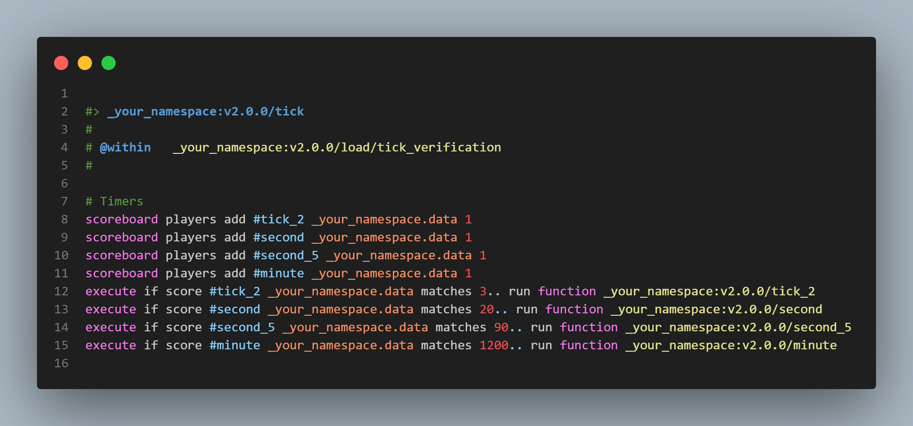 | 🟡 Partly dependent |
| 📋 **Finalization** | [`stewbeet.plugins.finalyze.dependencies`](./finalyze.dependencies.md) | Manages external library dependencies and integration | 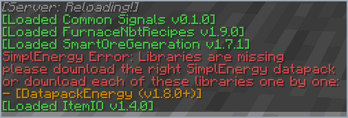 | 🔴 Fully dependent |
| 🔍 **Finalization** | [`stewbeet.plugins.finalyze.check_unused_textures`](./finalyze.check_unused_textures.md) | Identifies unused texture files in the resource pack | 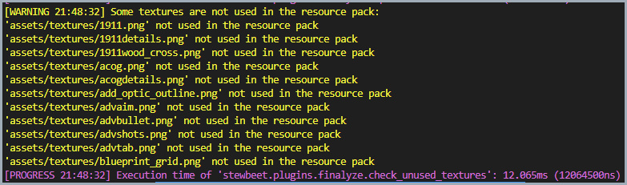 | 🟢 Independent |
| 🌐 **Automation** | [`stewbeet.plugins.auto.lang_file`](./auto.lang_file.md) | Automatically generates language files from text components |  | 🟢 Independent |
| 📝 **Automation** | [`stewbeet.plugins.auto.headers`](./auto.headers.md) | Adds automatic headers to mcfunction files showing usage context | 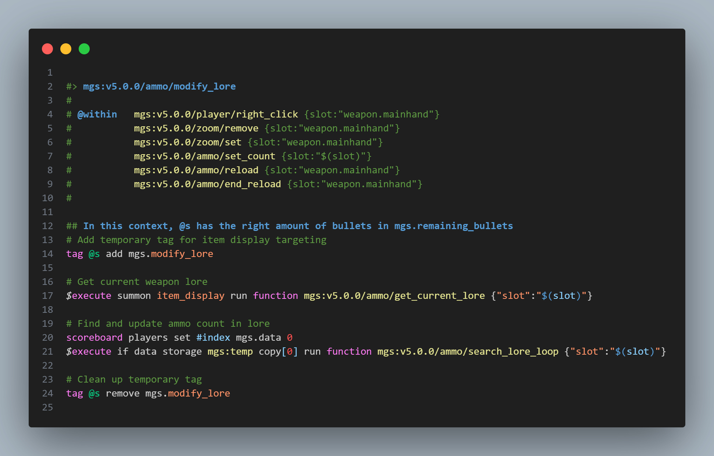 | 🟢 Independent |
| 📦 **Build** | [`stewbeet.plugins.archive`](./archive.md) | Creates zip archives of generated datapacks and resource packs | 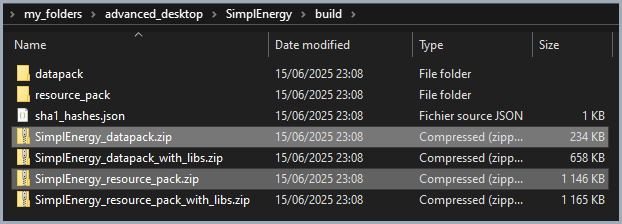 | 🟢 Independent |
| 🔗 **Build** | [`stewbeet.plugins.merge_smithed_weld`](./merge_smithed_weld.md) | Merges datapacks and resource packs with libraries using Smithed Weld | 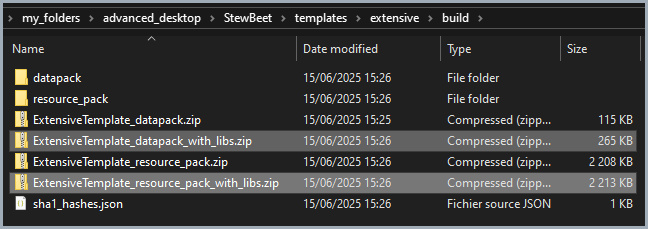 | 🟢 Independent |
| 📂 **Build** | [`stewbeet.plugins.copy_to_destination`](./copy_to_destination.md) | Copies generated packs to configured destination folders | 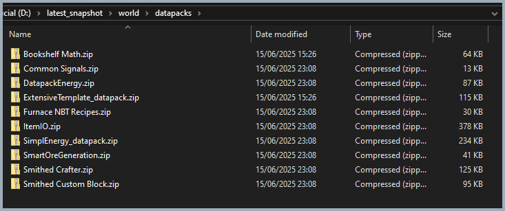 | 🟢 Independent |
| 🔐 **Build** | [`stewbeet.plugins.compute_sha1`](./compute_sha1.md) | Computes SHA1 hashes for all generated zip files |  | 🟢 Independent |

**Dependency Level Legend:**
- 🔴 **Fully dependent**: Requires StewBeet framework definitions and core functionality to operate
- 🟡 **Partly dependent**: Uses some StewBeet features but could be adapted for standalone use  
- 🟢 **Independent**: Can work without StewBeet framework dependencies

