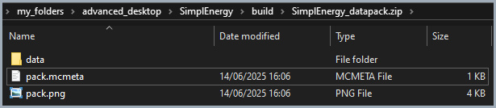

# 📦 stewbeet.plugins.archive

📄 **Source Code**: [stewbeet/plugins/archive/__init__.py](../../python_package/stewbeet/plugins/archive/__init__.py) 🔗

## 🔗 Dependencies
- **✅ Required**: Beet context with at least one type of pack (datapacks/resource packs)
- **✅ Required**: Configured output directory in project settings
- **📍 Position**: Should run after all pack generation is complete
- **🔧 Optional**: Beet cache directory for timestamp consistency
- **📋 Related**: Works with any plugins that generate pack content

## 📋 Overview
The `archive` plugin creates zip archives of generated datapacks and resource packs.<br>
It replaces the legacy archive system with beet-native functionality, providing<br>
deterministic compression, consistent timestamps, and parallel processing while<br>
preserving original pack directories and integrating seamlessly with beet's output system.

### <u>Some Features Showcase</u>

**Output directory will get both datapack and resource pack zipped**<br>


**We can see deterministic `Date modified` based of .beet_cache directory's one (no year 1900)**<br>


## 🎯 Purpose
- 📦 Creates zip archives of generated datapacks and resource packs
- 🕐 Provides consistent timestamps for reproducible builds
- ⚡ Uses parallel processing for efficient archive creation
- 🔧 Integrates with beet's native pack management system
- 📁 Preserves original pack directory structure
- 🎯 Replaces legacy archive systems with modern beet-compatible approach

## ⚙️ Configuration

### 🎯 Basic Example Configuration
```yaml
# No direct configuration required - uses project settings
# Requires output_directory to be configured in beet.yml:
output_directory: "build"

pipeline:
  - ...
  - stewbeet.plugins.archive
  - ... # Other finalization plugins that may depend on archives (e.g. compute_sha1, copy_to_destination, etc.)
```

### 📋 Configuration Options

| Option | Type | Default | Description |
|--------|------|---------|-------------|
| `output_directory` | string | **Required** | Directory where zip archives will be saved |
| Archive Naming | automatic | `{project_name}_{pack_type}.zip` | Naming convention for generated archives |
| Compression Level | constant | `6` | ZIP_DEFLATED compression level for optimal size/speed balance |
| Timestamp Source | automatic | Beet cache | Uses beet cache modification time for consistency |

## ✨ Features

### 🕐 Consistent Timestamp System
Ensures reproducible builds with deterministic timestamps:
- 📅 Uses beet cache directory modification time as timestamp source
- 🔄 Applies consistent timestamps to all zip entries
- 📦 Enables reproducible archive builds across environments
- ⏰ Falls back to default time (2025-01-01) if cache unavailable

### 📦 Pack Detection and Processing
Automatically detects and processes all generated packs:
- 🔍 Identifies both datapacks and resource packs from context
- 🏷️ Determines pack types automatically using isinstance checks
- 📝 Generates descriptive archive names based on project and pack type
- ✅ Validates pack availability before processing

### 🗜️ Advanced Compression System
Implements two-pass compression for optimal results:
- 🔧 Uses ZIP_DEFLATED compression with level 6 for size/speed balance
- 🔄 Two-pass system: first creates archive, then recreates with timestamps
- 📊 Handles beet's dump() system that bypasses standard writestr()
- ✅ Ensures all entries have consistent compression and timestamps

### ⚡ Parallel Archive Creation
Processes multiple packs simultaneously for efficiency:
- 🚀 Uses multithreading for simultaneous pack processing
- 📊 Optimizes worker count based on number of packs
- 🛡️ Includes error handling for robust archive creation
- ⚡ Significantly improves build times for multiple packs

### 🔧 Beet Integration System
Seamlessly integrates with beet's pack management:
- 📦 Uses pack.dump() to avoid interfering with existing directories
- 🎯 Leverages beet's native Context and pack system
- 📁 Preserves original pack structure and organization
- 🔗 Integrates with beet's output directory management

