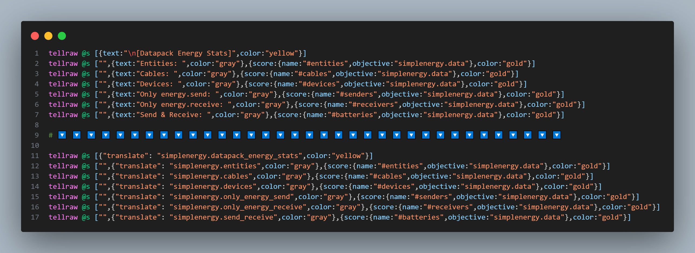
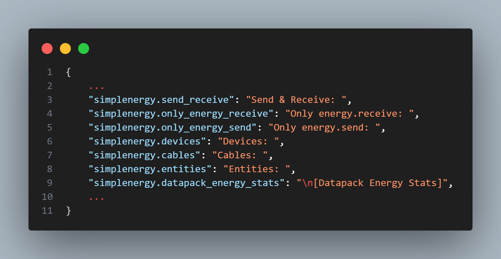

# 🌐 stewbeet.plugins.auto.lang_file

📄 **Source Code**: [stewbeet/plugins/auto/lang_file/__init__.py](../../python_package/stewbeet/plugins/auto/lang_file/__init__.py) 🔗<br>
📄 **Source Code**: [stewbeet/plugins/auto/lang_file/utils.py](../../python_package/stewbeet/plugins/auto/lang_file/utils.py) 🔗<br>

## 🔗 Dependencies
- **✅ Required**: Beet context with functions, loot tables, advancements, recipes, etc.
- **✅ Required**: Project ID for translation key namespacing
- **📍 Position**: Should run after content generation but before finalization
- **🔧 Optional**: Existing `en_us.json` language file (will be merged)
- **📋 Related**: Works with any plugins that generate text content

## 📋 Overview
The `auto.lang_file` plugin automatically generates language files for datapacks.<br>
It scans all functions and loot tables for hardcoded text strings, extracts them into<br>
translation keys, replaces the original text with `translate` text component keys, and generates<br>
a comprehensive `en_us.json` language file for internationalization support.

### <u>Feature Showcase</u>

**Before and after lang plugin:**<br>


**Generated `en_us.json` lang file:**<br>


## 🎯 Purpose
- 🌐 Automatically generates language files from hardcoded text
- 🔄 Converts `"text"` text component keys to `"translate"` keys
- 📝 Extracts text strings from functions and loot tables
- 🏷️ Creates standardized translation keys with project namespacing
- 🧹 Cleans and validates text content for language file inclusion
- 🚀 Enables internationalization support for datapacks

## ⚙️ Configuration

### 🎯 Basic Example Configuration
```yaml
pipeline:
  - ...
  - stewbeet.plugins.auto.lang_file
  - ...

# No configuration required - plugin runs automatically
# Processes all text files by default (functions, loot tables, advancements, etc.)
```

### 📋 Configuration Options

| Option | Type | Default | Description |
|--------|------|---------|-------------|
| Text Extraction | automatic | Enabled | Scans all "text" fields in file content |
| Key Generation | automatic | Project-based | Uses project ID for translation key prefixes |
| Parallel Processing | automatic | 32 workers | Multi-threaded file processing for performance |
| Language Target | constant | `en_us` | Generates English language file by default |

## ✨ Features

### 🔍 Text Extraction Engine
Scans content for hardcoded text using regex patterns:
- 📝 Uses advanced regex to find `"text": "value"` patterns
- 🔄 Handles escaped characters and various quote styles
- 📍 Tracks text positions for accurate replacement
- 🎯 Processes both single and double quoted strings

### 🏷️ Translation Key Generation
Creates standardized translation keys with project namespacing:
- 🧹 Cleans text by removing special characters and normalizing case
- 📏 Limits key length to 64 characters for compatibility
- 🔧 Uses project ID prefix for unique namespacing
- ✅ Validates keys to ensure they contain meaningful content

### 🔄 Content Replacement System
Replaces hardcoded text with translate components:
- 🔄 Converts `"text": "value"` to `"translate": "key"`
- 📍 Processes matches in reverse order to maintain position accuracy
- 🧹 Handles escape sequences and special characters properly
- ✅ Preserves JSON structure and formatting during replacement

### 🚀 Parallel Processing System
Efficiently processes multiple files using multi-threading:
- ⚡ Uses up to 32 worker threads for fast processing
- 📊 Processes both functions and loot tables simultaneously
- 🎨 Provides colored progress indicators during execution
- 🔧 Optimizes worker count based on file quantity

### 📋 Language File Management
Generates and updates the English language file:
- 📝 Creates `minecraft:en_us` language resource
- 🔄 Merges with existing language data if present
- 💾 Uses proper JSON formatting for compatibility
- 🌐 Sets up foundation for multi-language support

### 🧹 Content Validation System
Ensures only meaningful text gets processed:
- ✅ Skips text without alphanumeric characters
- 🔍 Validates minimum key length requirements
- 🚫 Excludes Unicode escapes and template variables
- 🎯 Prevents duplicate keys with conflicting values 

