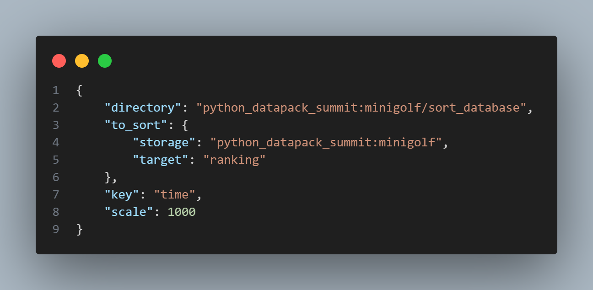
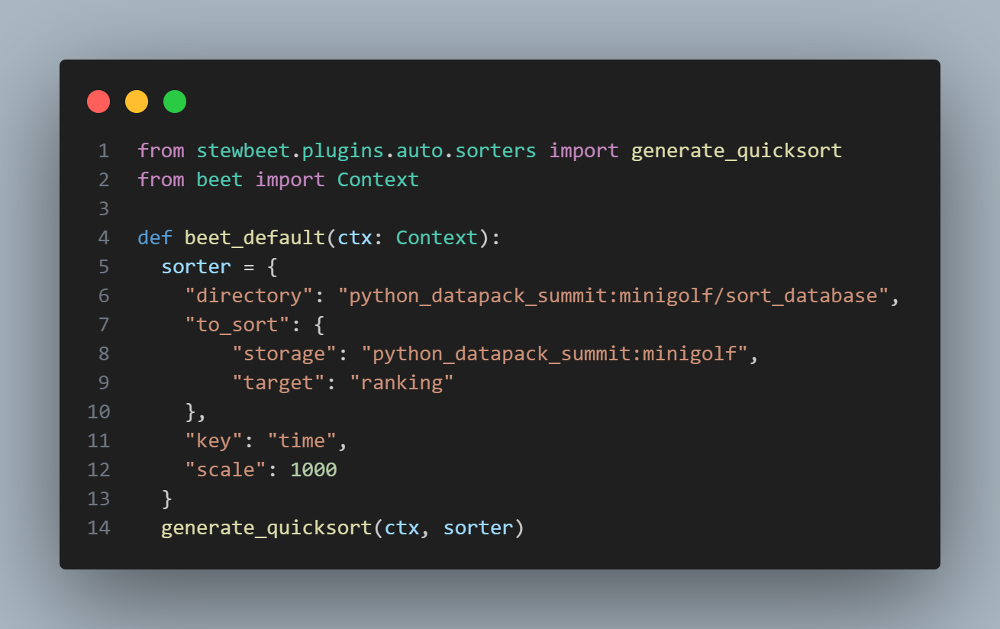
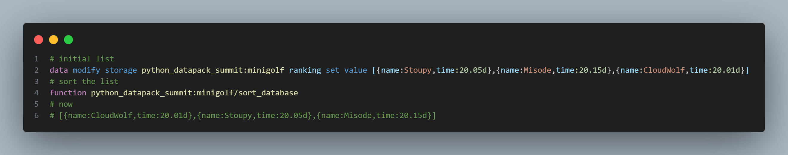

# 🔢 stewbeet.plugins.auto.sorter

📄 **Source Code**: [stewbeet/plugins/auto/sorter/__init__.py](../../python_package/stewbeet/plugins/auto/sorter/__init__.py) 🔗

## 📋 Overview
The `auto.sorter` plugin sorts lists in a configurable way.<br>
It creates sorting functions at compile time to ensure optimal performances.<br>

### <u>Quick Example</u>

**Sorters are declared in the `sorter` registry under `data/<namespace>`, like so:**<br>


**Alternatively, they can be generated with python:**<br>


**The list can now be sorted:**<br>



## 🎯 Purpose
- ⚡ Sort lists fast
- 💾 Optimize memory usage by implementing quicksort
- 🪄 Provide options for how elements are compared (future feature)

## ⚙️ Configuration
| Option | Type | Default | description |
|---|---|---|---|
| `algorithm` | string | `"quicksort"` | Does nothing currently.<br>*Other algorithms may be implemented in the future* |
| `directory` | string | **Required** | The function ID that sorts the list when called |
| `to_sort` | object | **Required** | The NBT path to the list |
| `key` | string | **Required** | The NBT tag pointing to the number getting compared |
| `scale` | integer | `1` | By how much the number getting compared should be scaled before being rounded down |


### 🎯 Basic Example Configuration
```yaml
id: "your_namespace"  # Required: project namespace
name: "Your Project Name"  # Required: display name for load messages

pipeline:
  - ...
  - stewbeet.plugins.auto.sorter  # Place this plugin in the pipeline
  - ...  # Other plugins follow
require:
  - ...
  - stewbeet.plugins.auto.sorter.extend_datapack # only if you want to register sorters as a custom resource
  - ...
```


## ✨ Features

### ⚡ Scaled Sorting
- 🔢 **Reverse Order** - A negative `scale` will sort the list in the reverse order
- 📊 **Precision** - A `scale` of `1000` will sort according to floats & doubles with 3 digits of precision

### 🔄 Individual configuration
- 🚫 **Override Prevention** - Each sorter has its own config, meaning multiple datapacks can use it in the same world without issue.

### 📦 Extended Datapack
- 🗄️ **Custom Resource** - Sorter objects can be defined at `data/<namespace>/sorter/whatever/path.json`

