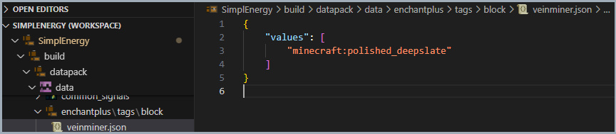

# ⚔️ stewbeet.plugins.compatibilities.neo_enchant

📄 **Source Code**: [stewbeet/plugins/compatibilities/neo_enchant/__init__.py](../../python_package/stewbeet/plugins/compatibilities/neo_enchant/__init__.py) 🔗

## 🔗 Dependencies
- **✅ Required**: `Your definition plugin` with `vanilla_block` configuration (see [`definitions_setup.md`](../definitions_setup.md) for details)
- **🔧 Optional**: NeoEnchant datapack (external dependency)
- **📋 Related**: Works with `datapack.custom_blocks` plugin ore functionality

## 📋 Overview
The `compatibilities.neo_enchant` plugin provides integration with the NeoEnchant datapack's<br>
veinminer functionality. It automatically detects when custom ore blocks use the<br>
`VANILLA_BLOCK_FOR_ORES` configuration and adds the corresponding vanilla block<br>
to NeoEnchant's veinminer block tag for proper mining compatibility.

### <u>Some Features Showcase</u>

**Automatic compatibility with Neo Enchant's veinminer enchant for custom ores:**<br>


## 🎯 Purpose
- ⛏️ Enables veinminer functionality for custom ore blocks
- 🔗 Integrates custom ores with NeoEnchant's mining system
- 🎯 Automatically detects ore block configurations
- 📋 Adds vanilla ore blocks to veinminer tags
- ⚡ Provides seamless mod compatibility
- 🧱 Supports the optimized ore system using polished deepslate

## ⚙️ Configuration

### 🎯 Basic Example Configuration
```yaml
pipeline:
  - ...
  - stewbeet.plugins.compatibilities.neo_enchant
  - ...

# No specific configuration required - automatically detects ore usage
```

### 📋 Configuration Options for item definitions

| Option | Type | Default | Description |
|--------|------|---------|-------------|
| `VANILLA_BLOCK_FOR_ORES` | constant | `{"id": "minecraft:polished_deepslate", "apply_facing": false}` | The vanilla block used for ore optimization |
| Ore Detection | automatic | N/A | Automatically scans definitions for ore blocks |

## ✨ Features

### 🔍 Automatic Ore Detection
Scans item definitions to identify ore blocks using the optimized ore system:
- 🎯 Detects items with `VANILLA_BLOCK_FOR_ORES` configuration
- ⛏️ Identifies custom ore blocks automatically
- 🧱 Focuses on polished deepslate-based ores
- ⚡ Leverages the optimized ore system design

### 📋 Veinminer Tag Generation
Creates the necessary block tag for NeoEnchant veinminer compatibility:
- 🏷️ Generates `enchantplus:veinminer` block tag
- 🧱 Adds `minecraft:polished_deepslate` to veinminer blocks
- 📦 Uses proper JSON encoding and formatting
- 🔗 Integrates with NeoEnchant's tag system

### ⚡ Optimization Integration
Works seamlessly with the StewBeet ore optimization system:
- 🎯 Leverages `VANILLA_BLOCK_FOR_ORES` constant
- 🔧 Supports the polished deepslate optimization
- ⛏️ Enables efficient veinmining of custom ores
- 🛡️ Maintains compatibility with ore break detection

### 🔄 Conditional Activation
Only activates when relevant ore configurations are detected:
- ✅ Checks for ore blocks in definitions before proceeding
- ⚡ Minimal performance impact when no ores are present
- 🎯 Smart detection based on vanilla block configuration
- 🔧 Automatic compatibility setup only when needed 

