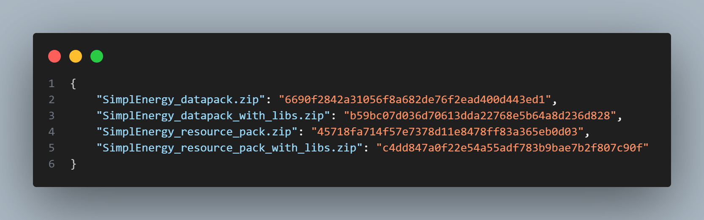

# 🔐 stewbeet.plugins.compute_sha1

📄 **Source Code**: [stewbeet/plugins/compute_sha1/__init__.py](../../python_package/stewbeet/plugins/compute_sha1/__init__.py) 🔗

## 📋 Overview
The `compute_sha1` plugin generates SHA1 hashes for all generated zip archives.<br>
It scans the output directory for zip files, computes their SHA1 checksums for integrity<br>
verification, and creates a comprehensive JSON file containing all hash values<br>
for distribution verification, security auditing, and change detection purposes.

### <u>Feature Showcase</u>

**Example content of `sha1_hashes.json`**<br>


## 🎯 Purpose
- 🔐 Computes SHA1 hashes for all generated zip archives
- 📋 Creates comprehensive hash manifest for integrity verification
- 🔍 Enables change detection between builds
- 🛡️ Provides security checksums for distribution verification
- 📁 Scans output directory automatically for zip files
- 💾 Generates machine-readable JSON hash file

## 🔗 Dependencies
- **📍 Position**: Should run after all archive generation plugins
- **🔧 Optional**: Multiple zip files in output directory (processes all found)
- **📋 Related**: Complements archive and merge_smithed_weld plugins

## ⚙️ Configuration

### 🎯 Basic Example Configuration
```yaml
# No direct configuration required - uses project settings
# Requires output_directory to be configured in beet.yml:
output_directory: "build"

pipeline:
  - ...
  - stewbeet.plugins.compute_sha1
```

### 📋 Configuration Options

| Option | Type | Default | Description |
|--------|------|---------|-------------|
| `output_directory` | string | **Required** | Directory containing zip files to hash |
| Hash Algorithm | constant | SHA1 | Uses SHA1 algorithm for checksum generation |
| Output File | constant | `sha1_hashes.json` | Filename for the generated hash manifest |
| File Filter | automatic | `*.zip` | Only processes files with .zip extension |

## ✨ Features

### 🔍 Automatic Archive Discovery
Scans output directory for zip files to process:
- 📁 Automatically discovers all zip files in the output directory
- 🔍 Uses file extension filtering to identify archive files
- 📋 Processes all found archives without manual configuration
- ✅ Handles empty directories gracefully with no errors

### 🔐 SHA1 Hash Computation
Generates secure SHA1 checksums for each archive:
- 🔐 Uses Python's built-in hashlib for reliable hash generation
- 📖 Reads files in binary mode for accurate checksum calculation
- 🎯 Generates standard hexadecimal hash representation
- ⚡ Processes files efficiently with stream reading

### 📋 Hash Manifest Creation
Creates comprehensive JSON file with all computed hashes:
- 📝 Stores filename-to-hash mappings in JSON format
- 🎨 Uses super_json_dump for properly formatted output
- 💾 Creates sha1_hashes.json file in the output directory
- 📊 Provides machine-readable format for automated verification

### 🛡️ Integrity Verification System
Enables integrity checking and change detection:
- ✅ Provides checksums for verifying archive integrity
- 🔍 Enables detection of file corruption or tampering
- 📊 Supports automated verification workflows
- 🔒 Creates audit trail for security compliance

### 📁 Output Directory Integration
Seamlessly integrates with beet's output directory system:
- 📂 Uses configured output directory from project settings
- ✅ Validates output directory existence before processing
- 🎯 Works with any output directory configuration
- 🔧 Integrates with beet's standard directory management

### ⚡ Efficient Processing Pipeline
Optimized for performance with minimal resource usage:
- ⏱️ Uses measure_time decorator for performance monitoring
- 💾 Reads files once for hash calculation
- 📊 Processes all files in a single pass
- 🧹 Clean and simple implementation with minimal overhead

