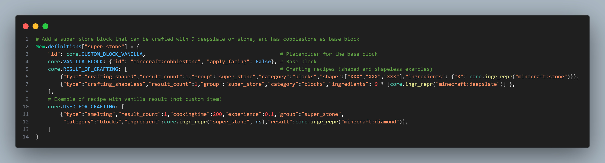
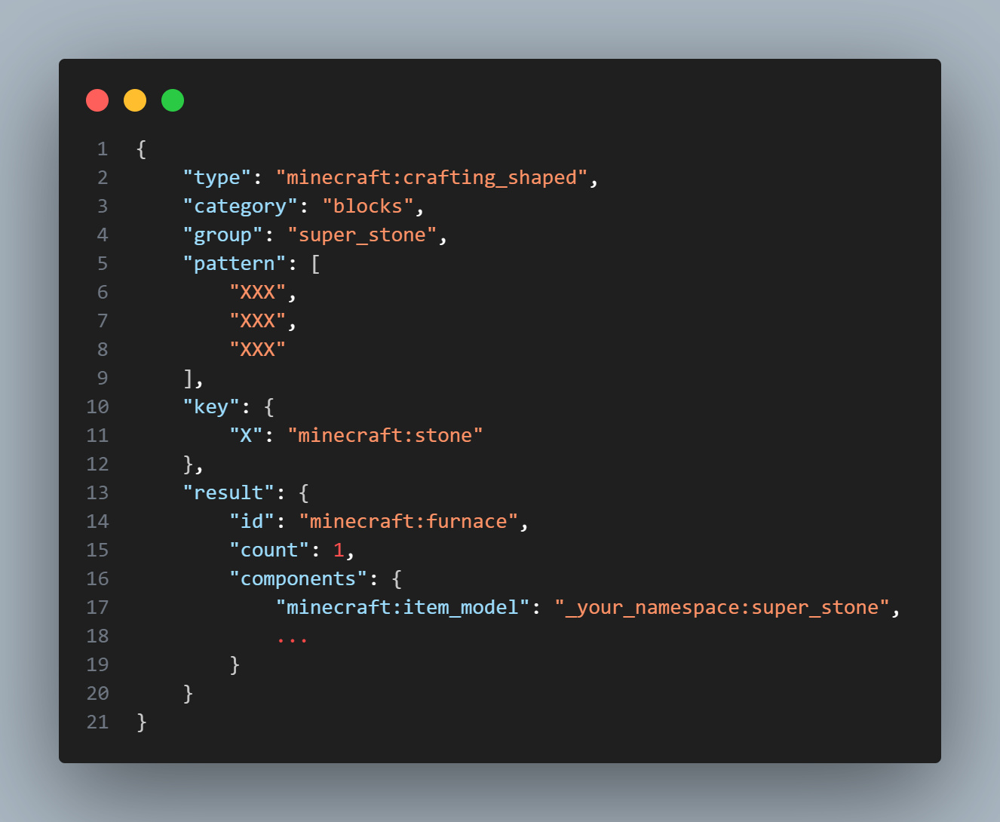
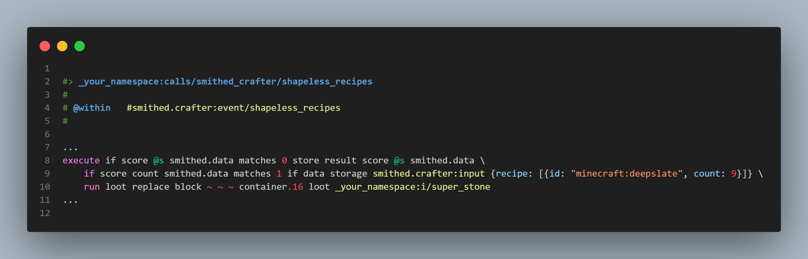
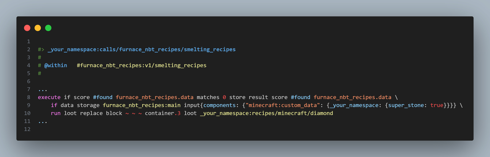

# 🍳 stewbeet.plugins.custom_recipes

📄 **Source Code**: [stewbeet/plugins/custom_recipes/__init__.py](../../python_package/stewbeet/plugins/custom_recipes/__init__.py) 🔗<br>
📄 **Source Code**: [stewbeet/plugins/custom_recipes/vanilla.py](../../python_package/stewbeet/plugins/custom_recipes/vanilla.py) 🔗<br>
📄 **Source Code**: [stewbeet/plugins/custom_recipes/smithed.py](../../python_package/stewbeet/plugins/custom_recipes/smithed.py) 🔗<br>
📄 **Source Code**: [stewbeet/plugins/custom_recipes/furnace.py](../../python_package/stewbeet/plugins/custom_recipes/furnace.py) 🔗<br>
📄 **Source Code**: [stewbeet/plugins/custom_recipes/pulverizer.py](../../python_package/stewbeet/plugins/custom_recipes/pulverizer.py) 🔗<br>

## 📋 Overview
The `custom_recipes` plugin generates custom recipes for datapacks based on item definitions.<br>
It supports multiple recipe types including vanilla crafting, smelting, Smithed Crafter recipes,<br>
and specialized recipes for SimplEnergy's pulverizer and furnaces with components.<br>
**(This plugin requires valid item definitions in memory to function properly.)**

### <u>Some Features Showcase</u>

**Item definition example ([source](../../templates/extensive/src/setup_definitions.py)):**<br>


**Generated vanilla crafting recipe ([source](../../templates/extensive/build/datapack/data/_your_namespace/recipe/super_stone.json)):**<br>


**Generated Smithed Crafter recipe ([source](../../templates/extensive/build/datapack/data/_your_namespace/function/calls/smithed_crafter/shapeless_recipes.mcfunction)):**<br>


**Generated furnace recipe with NBT data ([source](../../templates/extensive/build/datapack/data/_your_namespace/function/calls/furnace_nbt_recipes/smelting_recipes.mcfunction)):**<br>


## 🎯 Purpose
- 🛠️ Generates vanilla crafting recipes (shapeless, shaped, smelting, blasting, smoking)
- ⚙️ Creates Smithed Crafter custom recipes for advanced crafting systems
- 🔥 Handles furnace recipes with NBT data support
- ⚡ Generates pulverizer recipes for SimplEnergy integration
- 🎁 Creates recipe unlocking systems with advancement triggers
- 📋 Manages ingredient detection and recipe discovery

## 🔗 Dependencies
- **✅ Required**: `Your definition plugin` (see [`definitions_setup.md`](../definitions_setup.md) for details)<br>
- **✅ Required**: StewBeet framework initialization
- **📍 Position**: Should run after item model generation and before datapack finalization<br>
(see [`extensive/beet.yml`](../../templates/extensive/beet.yml) for an example)

## ⚙️ Configuration

### 🎯 Basic Configuration
```yaml
# No direct configuration required - recipes are defined in item definitions (see feature showcase)
```

### 📋 Configuration Options

| Option | Type | Default | Description |
|--------|------|---------|-------------|
| *Recipes in definitions* | list | `[]` | Recipe definitions are specified in individual item definitions under the `RESULT_OF_CRAFTING` and `USED_FOR_CRAFTING` keys |

## ✨ Features

### 🛠️ Vanilla Recipe Generation
**Supported Types:**
- 🔲 **Shapeless Crafting** - Any arrangement of ingredients
- 📐 **Shaped Crafting** - Specific pattern-based recipes
- 🔥 **Smelting** - Furnace, blast furnace, and smoker recipes
- 🍖 **Cooking** - Campfire and other cooking methods

**Features:**
- ✅ Automatic ingredient validation and conversion
- 🎁 Recipe **unlocking** system with advancement triggers
- 📋 Inventory-based recipe discovery
- 🔄 Custom item result support

### ⚙️ Smithed Crafter Integration
- 🛠️ **Shapeless Recipes** - Custom crafting without patterns
- 📐 **Shaped Recipes** - Pattern-based custom crafting
- 🎯 **Loot Table Results** - Advanced result generation
- 📦 **Command Integration** - Custom command execution support
- 🔧 **Unique Ingredient Handling** - Optimized ingredient processing

### 🔥 Furnace NBT Recipes
- 🔍 **NBT Data Support** - Custom data preservation during smelting
- ⚡ **Performance Optimization** - Efficient NBT handling
- 🎯 **Custom Result Generation** - Loot table integration
- 🔄 **Multi-type Support** - Furnace, blast furnace, smoker compatibility

### ⚡ Pulverizer Recipes
- 🏭 **SimplEnergy Integration** - Automatic pulverizer recipe generation
- 💎 **Ore Processing** - Dust and fragment generation
- 🔧 **Custom Results** - Flexible output configuration
- 📊 **Yield Control** - Configurable output quantities

### 🎁 Recipe Unlocking System
- 🏆 **Advancement Triggers** - Automatic recipe discovery
- 📦 **Inventory Detection** - Ingredient-based unlocking
- 🔄 **Dynamic Updates** - Real-time recipe availability
- 🎯 **Custom Item Support** - NBT-based custom item detection

### 📋 Recipe Management
- 🔍 **Ingredient Processing** - Smart ingredient parsing and validation
- 🏷️ **Category Organization** - Recipe categorization support
- 🎯 **Result Handling** - Flexible output configuration
- 📊 **Performance Optimization** - Cached recipe generation

