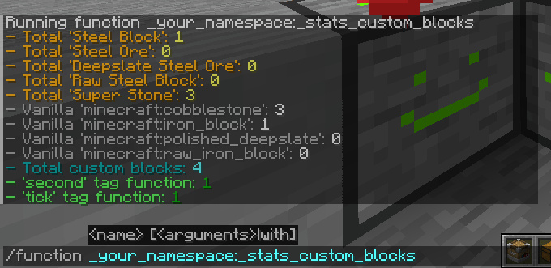
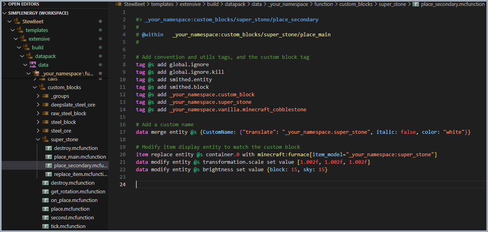

# 🧱 stewbeet.plugins.datapack.custom_blocks

📄 **Source Code**: [stewbeet/plugins/datapack/custom_blocks/__init__.py](../../python_package/stewbeet/plugins/datapack/custom_blocks/__init__.py) 🔗

## 🔗 Dependencies
- **✅ Required**: `Your definition plugin` with `vanilla_block` configuration (see [`definitions_setup.md`](../definitions_setup.md) for details)
- **🔧 Automatic**: Smithed Custom Block library (auto-detected and linked)
- **🔧 Automatic**: Common Signals library (for efficient custom ore break detection)
- **🔧 Automatic**: Furnace NBT Recipes library (for custom blocks that are custom furnace, e.g. Electric Furnace)

## 📋 Overview
The `datapack.custom_blocks` plugin enables custom blocks functionality in your datapack.<br>
It automatically generates placement, destruction, and management systems for custom blocks<br>
using vanilla blocks as the base, with support for Smithed Custom Block library integration,<br>
rotation mechanics, statistics tracking, and ore break detection.

### <u>Some Features Showcase</u>

**Advanced stats function:**<br>


**Complete file tree (ticking, placement, destroy, convention tags, etc.):**<br>


## 🎯 Purpose
- 🧱 Creates custom block placement and destruction systems
- 🔄 Handles block rotation and facing mechanics
- 📊 Provides statistics tracking for custom blocks
- ⚡ Optimizes performance with scoreboard-based counting
- ⛏️ Supports custom ore blocks with silk touch detection
- 🗿 Enables player head-based custom blocks
- 📚 Integrates with Smithed Custom Block library

## ⚙️ Configuration

### 🎯 Basic Example Configuration
```yaml
pipeline:
  - ...
  - src.setup_definitions  # Load item definitions into memory
  - ...
  - stewbeet.plugins.datapack.custom_blocks # < This plugin
  - ...
# No specific configuration required - works with item definitions
```

### 📋 Configuration Options in item definitions

| Option | Type | Default | Description |
|--------|------|---------|-------------|
| `vanilla_block.id` | string | **Required** | The vanilla block ID to use as the base block |
| `vanilla_block.apply_facing` | boolean | `false` | Whether to apply directional facing to the block |
| `item_model` | string | Optional | Custom item model for the block display entity |
| `no_silk_touch_drop` | string | Optional | Alternative drop when mined without silk touch (for ores) |
| `custom_data` | object | Optional | Custom NBT data for player head blocks |

Check extensive template [examples in `setup_definitions.py`](../../templates/extensive/src/setup_definitions.py)!

## ✨ Features

### 🏗️ Block Placement System
Automatically generates placement functions for each custom block:
- ✅ Handles block replacement with vanilla blocks
- 🔄 Applies rotation and facing mechanics when configured
- 🎯 Summons item display entities for visual representation
- 📊 Updates statistics and optimization scoreboards

### 🔄 Rotation and Facing Mechanics
Implements smart rotation detection for directional blocks:
- 🧭 Player rotation-based placement (north, east, south, west)
- 🎯 Predicate-based facing detection for existing blocks
- ⚙️ Automatic block state application with facing parameters

### 🎨 Item Display Configuration
Sets up item display entities with proper visual settings:
- 🏷️ Applies convention tags (smithed.entity, smithed.block)
- ✨ Sets custom names and model overrides
- 💡 Configures brightness and scale for optimal display
- 🔄 Applies rotation transformations for directional blocks

### 📚 Smithed Custom Block Integration
Automatically integrates with Smithed Custom Block library when needed:
- 🔗 Links placement functions to library events
- 📦 Handles block API data storage integration
- ⚡ Optimizes placement detection and execution

### 💥 Block Destruction Detection
Implements multi-layered destruction detection system:
- ⚡ Every 2 ticks: Fast detection for most blocks
- 🔍 Every 1 second: Advanced predicate-based detection
- 🛡️ Every 5 seconds: Comprehensive cleanup including ores
- 🎯 Block tag and predicate-based optimization

### ⛏️ Custom Ore Support
Special handling for custom ore blocks with advanced drop mechanics:
- 🔨 Silk touch detection and handling
- 💎 Alternative drops when mined without silk touch
- 📊 Item count preservation and transfer
- 🔗 Integration with Common Signals library

### 🗿 Player Head Custom Blocks (e.g. cables from SimplEnergy)
Support for player head-based custom blocks with advancement triggers:
- 🏆 Advancement-based placement detection
- 🔍 Area search within "configurable" radius
- 📦 Custom NBT data preservation
- ⚡ Automatic advancement revocation

### 📊 Statistics and Performance
Comprehensive statistics tracking and performance optimization:
- 📈 Total custom blocks count
- 🧱 Per-block type statistics
- 🎯 Vanilla block usage tracking
- ⚡ Scoreboard-based performance optimization

### 🔧 Special Integrations
- **🔥 Furnace NBT Recipes**: Auto-summons markers for furnace blocks
- **🏷️ Block Tags**: Creates optimized block tags for detection
- **🎯 Predicates**: Generates performance-optimized predicates

