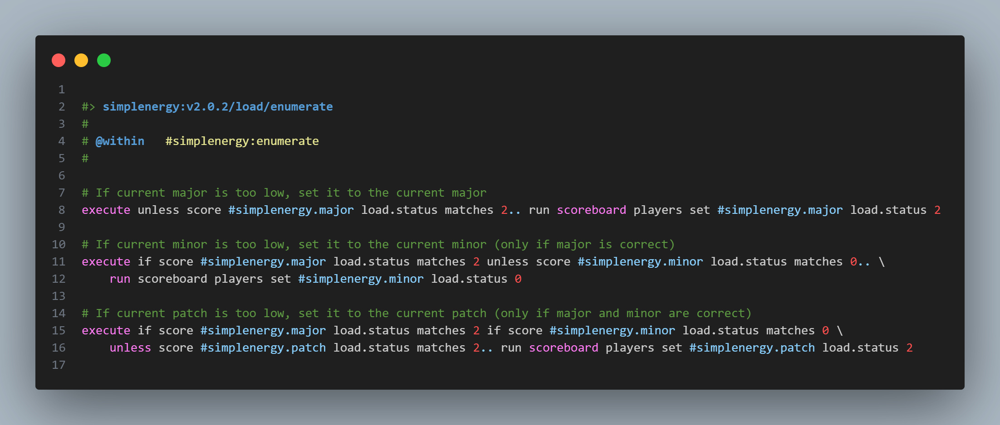
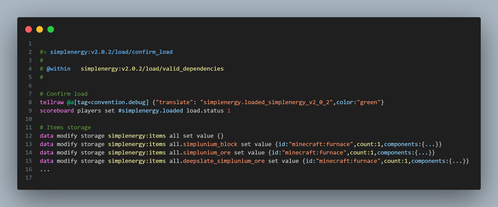
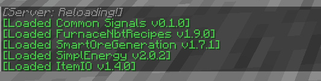

# ⚡ stewbeet.plugins.datapack.loading

📄 **Source Code**: [stewbeet/plugins/datapack/loading/__init__.py](../../python_package/stewbeet/plugins/datapack/loading/__init__.py) 🔗

## 🔗 Dependencies
- **✅ Required**: None (but works best with other StewBeet plugins)
- **🔗 Requires Later**: `stewbeet.plugins.finalyze.dependencies` (to complete setup)
- **📍 Position**: Should be placed after item definitions and before finalization plugins<br>
(see [`extensive/beet.yml`](../../templates/extensive/beet.yml) for an example)

## 📋 Overview
The `datapack.loading` plugin sets up the versioned loading system for Minecraft datapacks.<br>
It creates version checking functions, load management, and item storage systems following the LanternLoad convention.<br>
The plugin ensures proper datapack initialization with dependency validation and prevents duplicate loading.<br>
**(This plugin requires `stewbeet.plugins.finalyze.dependencies` later in the pipeline to complete the setup.)**

### <u>Some Features Showcase</u>

**Lantern Load Setup (#load, #enumerate, #resolve, etc.):**<br>


**All item definitions stored into a storage:**<br>


**Confirm datapack load for players with `convention.debug` tag:**<br>


## 🎯 Purpose
- ⚡ Sets up versioned datapack loading system
- 🔍 Implements version checking and validation
- 📦 Creates item storage systems for definitions
- 🔄 Prevents duplicate datapack loading
- 🏷️ Follows LanternLoad convention standards
- 📋 Manages load status tracking with scoreboards

## ⚙️ Configuration

### 🎯 Basic Example Configuration
```yaml
version: "1.0.0"  # Required: semantic version (major.minor.patch)
id: "your_namespace"  # Required: project namespace
name: "Your Project Name"  # Required: display name for load messages
```

### 📋 Configuration Options

| Option | Type | Default | Description |
|--------|------|---------|-------------|
| `version` | string | **Required** | Semantic version in format "major.minor.patch" for version checking |
| `id` | string | **Required** | Project namespace used for function and storage generation |
| `name` | string | **Required** | Display name used in load confirmation messages |

## ✨ Features

### ⚡ Versioned Loading System
- 🔢 **Version Parsing** - Splits semantic version into major.minor.patch components
- 📊 **Version Checking** - Creates enumerate function for version validation
- 🎯 **Load Resolution** - Generates resolve function for proper version loading
- 🏷️ **Function Tags** - Sets up enumerate and resolve function tags

### 🔄 Load Management
- 🚫 **Duplicate Prevention** - Prevents multiple executions of load functions
- 📋 **Status Tracking** - Uses scoreboards to track loading state
- 💬 **Load Confirmation** - Displays load messages to players with `convention.debug` tag
- ⚙️ **Secondary Function** - Manages actual load execution flow

### 📦 Item Storage System
- 🗄️ **Storage Initialization** - Creates namespace:items storage system
- 🔧 **Component Processing** - Handles item components and minecraft: namespace prefixing
- 🎯 **Data Filtering** - Excludes non-component data from storage
- 📝 **JSON Serialization** - Converts definitions to storage commands

