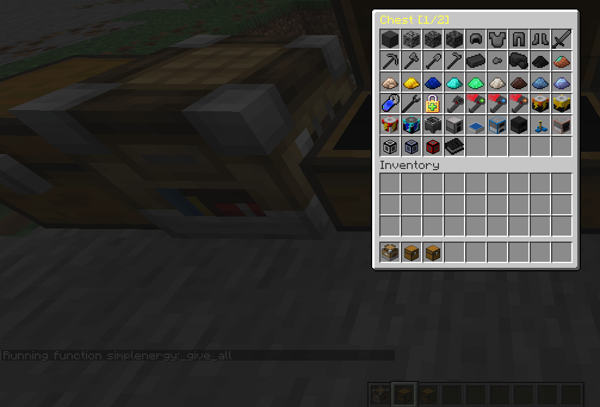

# 🎁 stewbeet.plugins.datapack.loot_tables

📄 **Source Code**: [stewbeet/plugins/datapack/loot_tables/__init__.py](../../python_package/stewbeet/plugins/datapack/loot_tables/__init__.py) 🔗

## 🔗 Dependencies
- **✅ Required**: `Your definition plugin` (see [`definitions_setup.md`](../definitions_setup.md) for details)
- **🔧 Optional**: External item definitions (`Mem.external_definitions`)

## 📋 Overview
The `datapack.loot_tables` plugin automatically generates loot tables for all custom items<br>
defined in the project definitions. It creates individual loot tables for each item with proper<br>
components, handles external items, supports crafting recipe variants, and generates<br>
convenient give-all commands for testing purposes.

### <u>Some Features Showcase</u>

**Complete file tree (i/\*, recipes/\*, external/\*):**<br>


**Function to give all items (comfortably stored in named chests):**<br>


## 🎯 Purpose
- 🎯 Generates individual loot tables for each custom item
- 🧩 Applies proper item components and metadata
- 🌐 Handles external items from other namespaces
- 📦 Creates variant loot tables for different crafting result counts
- 📚 Generates special loot tables for manual items
- 🎁 Creates convenient give-all commands with organized chest distribution

## ⚙️ Configuration

### 🎯 Basic Example Configuration
```yaml
id: "your_namespace"

pipeline:
  - ...
  - src.setup_definitions  # Load item definitions into memory
  - ...
  - stewbeet.plugins.datapack.loot_tables # < This plugin
  - ...

# Requires source_lore to be set in meta.stewbeet section
meta:
  stewbeet:
    source_lore: ""  # Required for chest lore generation
```

### 📋 Configuration Options

| Option | Type | Default | Description |
|--------|------|---------|-------------|
| `source_lore` | TextComponent | **Required** | Source lore text component used for give-all chest lore |
| `definitions` | object | **Required** | Item definitions to generate loot tables for |
| `external_definitions` | object | Optional | External item definitions from other namespaces |
| `result_of_crafting` | array | Optional | Crafting recipes with different result counts |

## ✨ Features

### 🎯 Individual Item Loot Tables
Generates dedicated loot tables for each item in definitions:
- ✅ Single item entry with proper ID reference
- 🧩 Automatic component application for all non-excluded properties
- 📁 Organized under `i/{item_name}` namespace structure
- 🔧 Proper JSON encoding with configurable max depth

### 🌐 External Item Support
Handles items from external namespaces and dependencies:
- 🌍 Namespace separation and proper file organization
- 📂 Storage under `external/{namespace}/{item}` structure
- 🔄 Same component processing as regular items
- 🔗 Integration with external definitions system

### 📦 Crafting Recipe Variants
Creates specialized loot tables for different crafting result counts:
- 🔢 Automatic detection of `result_of_crafting` with varying counts
- 📋 Generation of `i/{item}_x{count}` loot table variants
- 🔗 References to main item loot table with count modifications
- ⚡ Optimized for recipe systems that need specific quantities

### 📚 Manual Item Handling
Special loot table generation for manual items:
- 📖 Dedicated manual loot table creation
- 🔗 Reference to main manual item loot table
- 📝 Special naming convention with project namespace

### 🎁 Give-All Command Generation
Creates convenient testing commands with organized chest distribution:
- 📦 Automatic chest organization (27 items per chest)
- 🏷️ Custom chest names with numbering (e.g., "Chest [1/3]")
- ✨ Source lore application to all chests
- 🧹 Component cleanup excluding non-component data
- 📊 Optimal distribution across multiple chests when needed 

