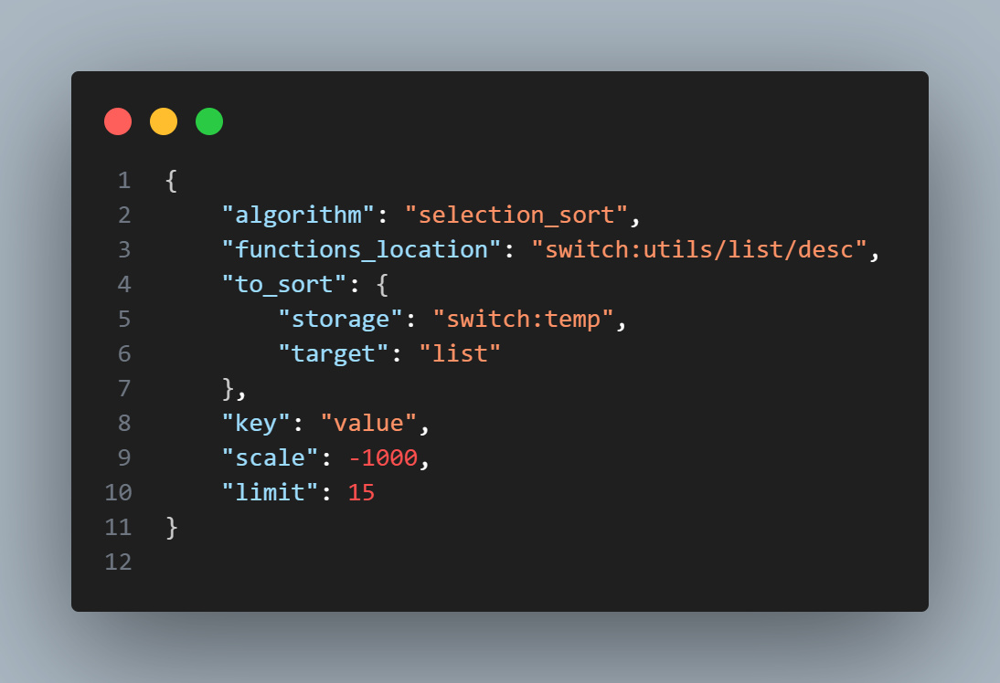
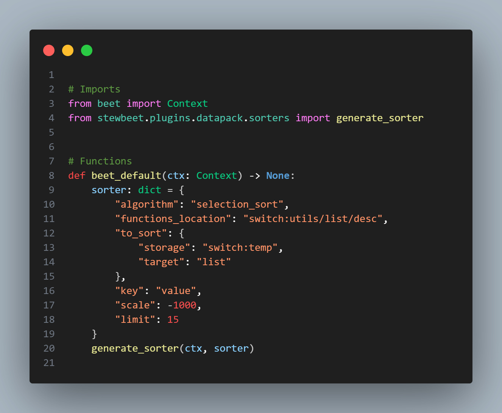
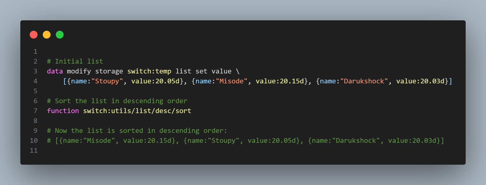

# 🔢 stewbeet.plugins.datapack.sorters

📄 **Source Code**: [stewbeet/plugins/datapack/sorters/__init__.py](../../python_package/stewbeet/plugins/datapack/sorters/__init__.py) 🔗<br>
📄 **Source Code**: [stewbeet/plugins/datapack/sorters/constants.py](../../python_package/stewbeet/plugins/datapack/sorters/constants.py) 🔗<br>
📄 **Source Code**: [stewbeet/plugins/datapack/sorters/extend_datapack.py](../../python_package/stewbeet/plugins/datapack/sorters/extend_datapack.py) 🔗<br>
📄 **Source Code**: [stewbeet/plugins/datapack/sorters/match.py](../../python_package/stewbeet/plugins/datapack/sorters/match.py) 🔗<br>
📄 **Source Code**: [stewbeet/plugins/datapack/sorters/quick_sort.py](../../python_package/stewbeet/plugins/datapack/sorters/quick_sort.py) 🔗<br>
📄 **Source Code**: [stewbeet/plugins/datapack/sorters/selection_sort.py](../../python_package/stewbeet/plugins/datapack/sorters/selection_sort.py) 🔗<br>

## 💻 Credits
**Author**: [Darukshock](https://github.com/Darukshock) - Original implementation of the quick sort algorithm

## 📋 Overview
The `datapack.sorters` plugin generates efficient sorting functions for Minecraft datapacks.<br>
It creates optimized mcfunction files at compile time that can sort lists stored in NBT storage<br>
using configurable algorithms (Quick Sort and Selection Sort), with support for custom comparison<br>
keys, scaling factors, and performance optimizations tailored for Minecraft's execution environment.

## 🔗 Dependencies
- **✅ Required**: Beet context with datapack namespace support
- **📍 Position**: Can run at any point during compilation
- **🔧 Extension**: Requires `stewbeet.plugins.datapack.sorters.extend_datapack` to register sorter namespace

### <u>Quick Example</u>

**Sorters are declared in the `sorters` registry under `data/<namespace>`, like so:**<br>
`data/<namespace>/sorter/<sorter_name>.json`<br>


**Alternatively, they can be generated with python:**<br>


**The list can now be sorted:**<br>


## 🎯 Purpose
- 🚀 Generate high-performance sorting functions for NBT storage lists
- 🎯 Support multiple sorting algorithms optimized for Minecraft's execution model
- 📊 Handle complex data structures with configurable comparison keys
- ⚡ Provide in-place sorting with minimal memory overhead
- 🔧 Enable precision control through scaling for decimal values
- 📈 Support partial sorting with element limits for performance optimization

## ⚙️ Configuration

### 📋 Configuration Options

| Option | Type | Default | Description |
|--------|------|---------|-------------|
| `algorithm` | string | **Required** | Sorting algorithm to use: `"selection_sort"` (recommended) or `"quick_sort"` |
| `functions_location` | string | **Required** | Namespaced function ID where sorting functions are generated |
| `to_sort` | object | **Required** | Storage location containing `storage` and `target` keys |
| `to_sort.storage` | string | **Required** | Storage namespace (e.g., `"switch:stats"`) |
| `to_sort.target` | string | **Required** | NBT path to the list (e.g., `"all.modes.sheepwars.played"`) |
| `key` | string | **Required** | Key within each list element to compare for sorting |
| `scale` | float | `1.0` | Optional: Scaling factor for numeric values (`negative for descending order`) |
| `limit` | integer | `null` | Optional: Maximum elements to sort (selection_sort only) |

**⚡ Performance Note**: Selection sort significantly outperforms quick sort in Minecraft's storage environment due to quick sort's heavy reliance on macro expansions. Each recursive call in quick sort generates multiple macro invocations for parameter passing and storage manipulation, creating substantial overhead that negates the theoretical O(n log n) advantage. Selection sort's straightforward O(n²) approach with minimal macro usage proves more efficient for typical Minecraft datapack sorting operations.

### 🎯 Basic Example Configuration
```yaml
require:
  - ...
  - stewbeet.plugins.datapack.sorters.extend_datapack # Required: register "data/<namespace>/sorter/" as a custom resource
  - ...

pipeline:
  - ...
  - stewbeet.plugins.datapack.sorters  # Place this plugin in the pipeline
  - ...  # Other plugins follow
```

### 📝 Example Sorter Configuration
```json
{
	"algorithm": "selection_sort",
	"functions_location": "switch:stats/minigame/sort_leaderboard",
	"to_sort": {
		"storage": "switch:stats",
		"target": "all.modes.sheepwars.played"
	},
	"key": "count",
	"scale": 100,
	"limit": 10
}
```

## 👓 Spyglass implementation
Combined with the [Spyglass](https://spyglassmc.com) extension for [Visual Studio Code](https://code.visualstudio.com), auto-completion and syntax checking can be obtained on sorter files.<br>
**Here's how:**<br>
- If you haven't already, open your project on Visual Studio Code and install the Spyglass extension.
- Create a [Spyglass Config File](https://spyglassmc.com/user/config.html), and under the `env` field, add the following :
```json
"customResources": {
	"sorter": {
		"category": "sorter"
	}
}
```
- Anywhere in your workspace, create `sorter.mcdoc`: [stewbeet/plugins/datapack/sorters/mod.mcdoc](../../python_package/stewbeet/plugins/datapack/sorters/mod.mcdoc) 🔗<br>
*Note: it will work no matter the name as long as it ends in `.mcdoc`*
- Restart Visual Studio Code

## ✨ Features

### 🎛️ Algorithm Selection System
- 🥇 **Selection Sort** - Recommended for better Minecraft performance
- ⚡ **Quick Sort** - Alternative using recursive function calls
- 📊 **Automatic Routing** - Algorithm selection based on configuration

### 📦 Extended Datapack Support
- 🗄️ **Custom Resource Type** - Sorter objects at `data/<namespace>/sorter/path.json`
- 👓 **Spyglass Support** - Syntax checking and auto-completion
- ✅ **Multi-Datapack Support** - Independent configurations

### 🔢 Advanced Scaling System
- 📊 **Precision Control** - Scale factor for decimal precision (e.g., `1000` for 3 decimals)
- 🔄 **Reverse Sorting** - Negative scale values for descending order

### ⚡ Selection Sort Implementation
- 🔍 **Minimum Finding** - Efficient linear search
- 🚀 **Partial Sorting** - Optional limit parameter for top-N sorting
- 💾 **Memory Efficient** - In-place sorting with minimal storage overhead

### 🚅 Quick Sort Implementation
- 📊 **Pivot Selection** - Last element partitioning
- 🔄 **Recursive Calls** - Function-based recursion with macros
- ⚠️ **Performance Note** - Less efficient than selection sort due to macro overhead

### 📝 Configuration & Generation
- ✅ **Input Validation** - Type checking and required field validation
- � **Function Generation** - Dynamic mcfunction file creation with macro integration
- � **Memory Management** - Temporary storage with automatic cleanup

