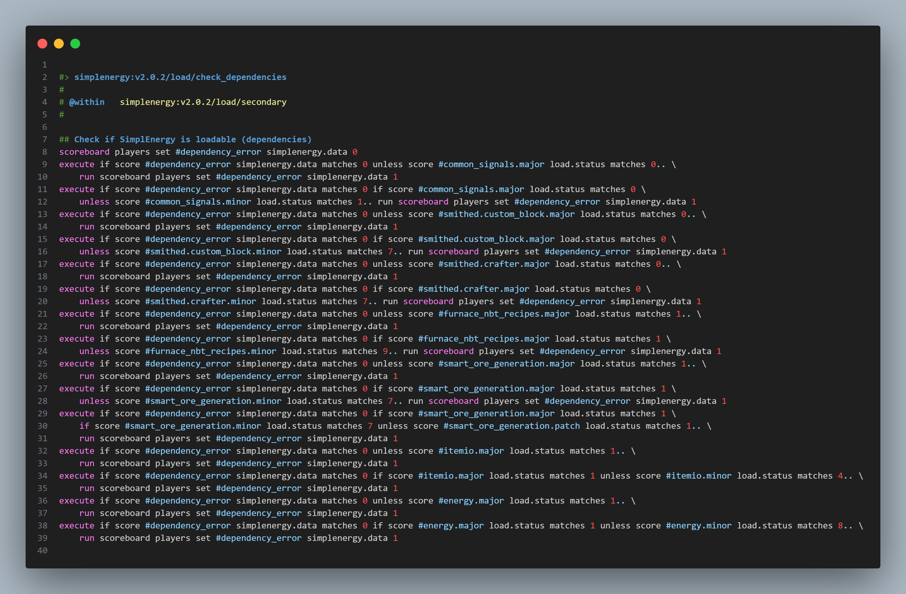

# 📋 stewbeet.plugins.finalyze.dependencies

📄 **Source Code**: [stewbeet/plugins/finalyze/dependencies/__init__.py](../../python_package/stewbeet/plugins/finalyze/dependencies/__init__.py) 🔗

## 🔗 Dependencies
- **✅ Required**: Project ID, version, name, and author in context
- **🔧 Optional**: Official libraries (auto-detected from function usage)
- **🔧 Optional**: Custom load dependencies in metadata
- **📋 Related**: Integrates with Lantern Load system

## 📋 Overview
The `finalyze.dependencies` plugin manages datapack dependencies and load sequence.<br>
It automatically detects library usage, sets up version checking, integrates with Lantern Load<br>
for proper loading order, and creates comprehensive dependency validation systems<br>
with user-friendly error messages and compatibility checks.

### <u>Some Features Showcase</u>

**Creates a dependencies check function and later use it:**<br>


**Errors in chat when loading if missing dependencies:**<br>


## 🎯 Purpose
- 📦 Manages datapack dependencies and load sequence
- 🔍 Automatically detects official library usage in functions
- ✅ Implements comprehensive version checking and validation
- 🔗 Integrates with Lantern Load for proper loading order
- 🎮 Checks Minecraft version compatibility
- 📢 Provides user-friendly error messages and dependency links

## ⚙️ Configuration

### 🎯 Basic Example Configuration
```yaml
pipeline:
  - ...
  - stewbeet.plugins.finalyze.dependencies  # Should be run after all functions are defined
  - ...

# Dependencies are automatically detected from function usage
# Custom dependencies can be added via metadata:
meta:
  stewbeet:
    load_dependencies:
      custom_lib_namespace:
        name: "Custom Library Name"           # Name you want to display when error occurs
        version: [1, 0, 0]                    # Version of the dependency to check for
        url: "https://example.com/library"    # URL to download the library if missing
    libs_folder: "libs" # Optional folder for custom libraries (datapack and resource pack)
```

### 📋 Configuration Options

| Option | Type | Default | Description |
|--------|------|---------|-------------|
| `load_dependencies` | object | `{}` | Custom dependencies to add to the load system |
| Official Library Detection | automatic | Enabled | Scans functions for official library usage |
| Version Checking | automatic | Enabled | Validates dependency versions on load |
| Minecraft Version | constant | `DATA_VERSION` | Required Minecraft version for compatibility |

## ✨ Features

### 🔍 Automatic Library Detection
Scans all functions to detect official library usage:
- 🔥 Detects Furnace NBT Recipes usage in function text
- 📡 Identifies Common Signals library references
- 📦 Finds ItemIO library usage
- 📚 Scans for all Bookshelf module usage with `#{module}:` patterns
- 🏷️ Automatically marks detected libraries as used

### 🔗 Lantern Load Integration
Sets up proper loading infrastructure with Lantern Load:
- 🏷️ Creates minecraft:load function tag linking to Lantern Load
- 📋 Sets up load phases (init, pre_load, load, post_load)
- 🔄 Initializes scoreboard objectives for load status tracking
- ⚙️ Provides proper loading sequence management

### 📦 Dependency Chain Management
Creates proper dependency loading order:
- 🔗 Links dependencies with `#{namespace}:load` function tags
- 📚 Handles Bookshelf special case with `#bs.load:load`
- 🎯 Removes duplicate dependencies while preserving order
- ⚡ Uses optional function tags for graceful missing dependency handling

### ✅ Version Validation System
Implements comprehensive version checking:
- 🔢 Checks major, minor, and patch version compatibility
- 📚 Handles Bookshelf special scoring syntax (`$bs` vs `#`)
- 🎯 Supports both encoder (error flags) and decoder (user messages) modes
- ⚡ Provides granular version requirement validation

### 🎮 Minecraft Compatibility Checking
Validates Minecraft version compatibility:
- 🎮 Reads player DataVersion for current Minecraft version
- ✅ Compares against required DATA_VERSION constant
- 📢 Shows user-friendly error messages for version mismatches
- 🔄 Schedules retry if no players are online during load

### 📢 User-Friendly Error System
Provides comprehensive error reporting and resolution:
- 🔗 Generates clickable links to dependency download pages
- 📝 Shows clear library names and required versions
- 🎨 Uses color-coded messages (red for errors, gold for links)
- 📋 Lists all missing dependencies with download instructions

### ⚡ Smart Ore Generation Integration
Special integration for Smart Ore Generation library:
- 🔗 Links custom ore generation functions to library signals
- 📦 Supports denied_dimensions, generate_ores, and post_generation
- 🎯 Only activates when Smart Ore Generation is detected as used
- ⚙️ Provides seamless integration with ore generation systems 

