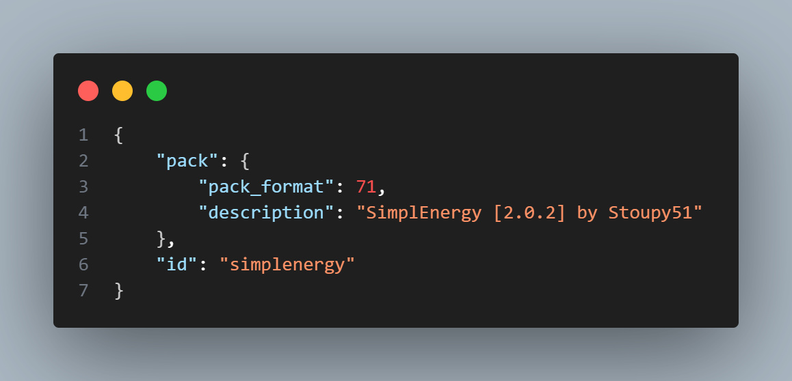
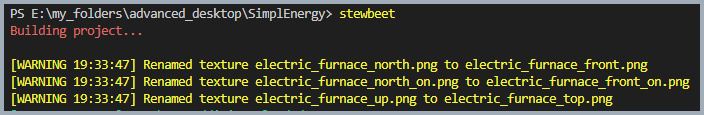

# 🚀 stewbeet.plugins.initialize

📄 **Source Code**: [stewbeet/plugins/initialize/__init__.py](../../python_package/stewbeet/plugins/initialize/__init__.py) 🔗

## 📋 Overview
The `initialize` plugin is the foundation of the StewBeet framework.<br>
It sets up the core infrastructure, initializes project metadata, configures pack.mcmeta files,<br>
and prepares the build environment for all subsequent plugins.

### <u>Some Features Showcase</u>

**Automatic Item Lore (If not configured) for item definitions**<br>


**Automatic pack.mcmeta + Automatic description (If not configured)**<br>


**Legacy Texture Naming Conversion**<br>
 |


## 🎯 Purpose
- 🛠️ Initializes the StewBeet framework
- ⚙️ Sets up more project metadata and configurations
- 📦 Configures pack.mcmeta for both datapacks and resource packs
- 📝 Preprocesses project descriptions and few settings
- 🔄 Handles legacy texture naming conversions
- 🏷️ Creates source lore fonts for item identification

## 🔗 Dependencies
- **✅ Required**: None (this is the first plugin in the pipeline)
- **📍 Position**: Must be the first plugin in the beet.yml pipeline<br>
(see [`extensive/beet.yml`](../../templates/extensive/beet.yml) for an example)

## ⚙️ Configuration

### 🎯 Basic Example Configuration
```yaml
name: "SimplEnergy"
version: "2.0.2"

pipeline:
  - stewbeet.plugins.initialize  # must be the first plugin
  - ...  # other plugins follow

description: ""  # or custom description
meta:
  stewbeet:
    source_lore: ""          # or custom text component
    textures_folder: "assets/textures"
    manual:
      name: ""                   # defaults to "{project_name} Manual"
```

### 📋 Configuration Options

| Option | Type | Default | Description |
|--------|------|---------|-------------|
| `description` | TextComponent | `""` | Project description for pack.mcmeta. Defaults to "{project_name} [{project_version}] by {project_author}" |
| `source_lore` | TextComponent | `""` | Lore text for item identification. Defaults [{"text":"ICON"},{"text":" {project_name}","italic":true,"color":"blue"}] |
| `textures_folder` | string | `"assets/textures"` | Path to the textures folder |
| `manual.name` | string | `""` | Name for the in-game manual. Defaults to "{project_name} Manual" |

## ✨ Features

### 🚀 Framework Initialization
- 🛠️ Sets up the StewBeet memory system (`Mem.ctx`)
- 🔄 Converts the context meta to a Box object for easier access
- ⚙️ Initializes core project configurations

### 📦 Pack.mcmeta Generation
Automatically generates pack.mcmeta files for both datapacks and resource packs with:
- ✅ Correct pack format versions
- 📝 Project description
- 🆔 Project ID
- 🔧 Proper JSON encoding

### 📊 Project Metadata Processing
- **📝 Project Description**: Auto-generates if set to "auto"
- **🏷️ Source Lore**: Creates item identification lore (source code: [`source_lore_font.py`](../../python_package/stewbeet/plugins/initialize/source_lore_font.py))
- **📖 Manual Name**: Sets default manual name if not specified

### 🖼️ Pack Icon Management
Automatically handles pack.png icon distribution:
- 🔍 Searches for pack.png in common locations (`src/pack.png`, `assets/pack.png`, `*pack.png`)
- 📦 Copies pack.png to both datapack and resource pack outputs
- 🎨 Uses `PngFile` for proper beet integration
- ✅ Ensures consistent branding across both pack types

### 🔄 Legacy Support
Handles legacy texture naming conversions for better later compatibility/pattern matching:
- `_off` → (removed) ❌
- `_down` → `_bottom` ⬇️
- `_up` → `_top` ⬆️
- `_north` → `_front` ⬆️
- `_south` → `_back` ⬇️
- `_west` → `_left` ⬅️
- `_east` → `_right` ➡️

