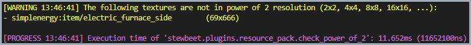

# 🖼️ stewbeet.plugins.resource_pack.check_power_of_2

📄 **Source Code**: [stewbeet/plugins/resource_pack/check_power_of_2/__init__.py](../../python_package/stewbeet/plugins/resource_pack/check_power_of_2/__init__.py) 🔗

## 📋 Overview
The `check_power_of_2` plugin validates that all textures in the resource pack have power-of-2 dimensions.<br>
This validation helps ensure optimal performance and compatibility with Minecraft's texture system.<br>
**(This plugin requires textures to be already processed and added to the resource pack.)**

### <u>Features Showcase</u>

**Warning messages:**<br>


## 🎯 Purpose
- 🔍 Validates texture dimensions for power-of-2 compliance (2x2, 4x4, 8x8, 16x16, etc.)
- ⚠️ Warns about non-compliant textures that may cause performance issues
- 📊 Checks both item and block textures in the resource pack
- 🎨 Excludes animation textures and GUI elements with valid aspect ratios
- 🛡️ Helps maintain texture optimization standards

## 🔗 Dependencies
- **✅ Required**: Resource pack textures (from previous plugins like `resource_pack.item_models`)
- **📍 Position**: Can run at any position but after textures are added to the project<br>
(see [`extensive/beet.yml`](../../templates/extensive/beet.yml) for an example)

## ⚙️ Configuration

### 🎯 Basic Configuration
```yaml
pipeline:
  - ...
  - "stewbeet.plugins.resource_pack.check_power_of_2"
  - ...
```

### 📋 Configuration Options

| Option | Type | Default | Description |
|--------|------|---------|-------------|
| *No configuration options* | - | - | This plugin runs without any configuration parameters |

## ✨ Features

### 🔍 Power-of-2 Validation
- 📏 Checks texture dimensions using binary bit counting (`bin(dimension).count("1") == 1`)
- ✅ Validates that width and height are powers of 2 (1, 2, 4, 8, 16, 32, 64, 128, 256, 512, 1024...)
- 🎯 Focuses on item and block textures using pattern matching (`*item/*`, `*block/*`)

### 🎨 Smart Filtering
- 📱 Excludes animation textures (where height is divisible by width and not square)
- 🖼️ Skips GUI textures and valid rectangular sprites
- 🔍 Only flags problematic square textures or invalid aspect ratios
- ⚡ Reduces false positives for intentional non-square textures

### ⚠️ Warning System
- 📋 Generates detailed warning messages for non-compliant textures
- 📍 Shows exact file paths and dimensions for easy identification
- 📊 Lists all problematic textures in a single comprehensive report

*Note: This plugin provides validation benefits rather than direct code implementation for performance optimization.*

