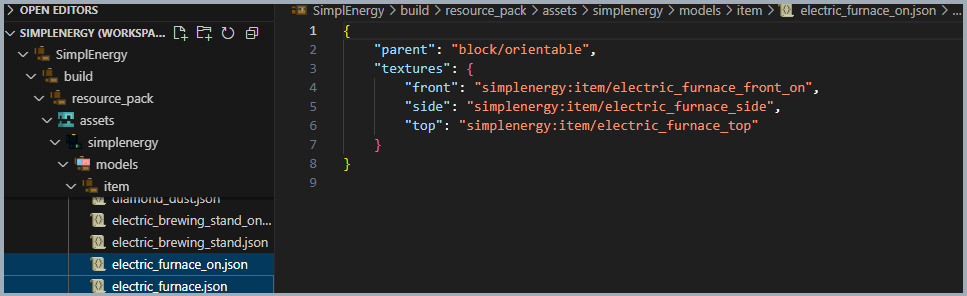

# 🎨 stewbeet.plugins.resource_pack.item_models

📄 **Source Code**: [stewbeet/plugins/resource_pack/item_models/__init__.py](../../python_package/stewbeet/plugins/resource_pack/item_models/__init__.py) 🔗<br>
📄 **Source Code**: [stewbeet/plugins/resource_pack/item_models/object.py](../../python_package/stewbeet/plugins/resource_pack/item_models/object.py) 🔗<br>

## 🔗 Dependencies
- **✅ Required**: `Your definition plugin` (see [`definitions_setup.md`](../definitions_setup.md) for details)
- **✅ Required**: `textures_folder` configuration in meta.stewbeet
- **📍 Position**: Should run after verification plugins and before finalization<br>
(see [`extensive/beet.yml`](../../templates/extensive/beet.yml) for an example)

## 📋 Overview
The `item_models` plugin automatically generates item and block models for custom items defined in the StewBeet framework.<br>
It intelligently processes textures, handles powered states, generates specialized models for different block types,<br>
and creates the necessary item model files for Minecraft resource packs.<br>
**(This plugin requires item definitions in memory and the `textures_folder` configuration.)**

### <u>Some Features Showcase (example from [SimplEnergy](https://github.com/Stoupy51/SimplEnergy/tree/main/assets/textures/))</u>

**Automatically detects texture patterns:**<br>


**Both models are automatically created and ready to use (`models/item/*` and `items/*`):**<br>


## 🎯 Purpose
- 🧊 Generates block models with automatic pattern detection (cube, cake, orientable, etc.)
- 🗡️ Creates item models with proper texture layering and parent inheritance
- ⚡ Handles powered states for blocks (_on variants)
- 🏹 Supports specialized models (bow pulling animations, leather armor overlays)
- 🖼️ Automatically processes and copies textures from source folders
- 📄 Generates both `items/*.json` files and `models/[item|block]/*.json` files
- 🎯 Tracks rendered models to prevent duplicates

## ⚙️ Configuration

### 🎯 Basic Example Configuration
```yaml
pipeline:
  - ...
  - src.setup_definitions  # Load item definitions into memory
  - ...
  - stewbeet.plugins.resource_pack.item_models  # Check both item definitions and your textures to generate models
  - ...

meta:
  stewbeet:
    textures_folder: "assets/textures"  # Path to textures directory
```

### 📋 Configuration Options

| Option | Type | Default | Description |
|--------|------|---------|-------------|
| `textures_folder` | string | `"assets/textures"` | Path to the directory containing texture files. Must be set in `meta.stewbeet.textures_folder` |

## ✨ Features

### 🧊 Block Model Generation
Automatically detects texture patterns and generates appropriate block models:

**🍰 Cake Model** (requires: bottom, side, top, inner textures)
- Creates main cake model with proper texture mapping
- Generates 6 slice models for each cake state
- Maps `inner` texture to `inside` in model

**🔲 Cube Bottom Top, e.g. barrel** (requires: bottom, side, top textures)
- Uses `minecraft:block/cube_bottom_top` parent
- Perfect for blocks with different top/bottom faces

**⬆️ Orientable Model** (requires: front, side, top textures)
- Uses `minecraft:block/orientable` parent
- Ideal for directional blocks like furnaces

**📦 Cube Column** (requires: end, side textures)
- Uses `minecraft:block/cube_column` parent
- Great for pillar-like blocks

### 🗡️ Item Model Generation
- 📋 Uses appropriate parent models based on item type
- 🛡️ Handles leather armor with layer1 overlays
- 🏹 Creates bow pulling animations with range dispatch
- ⚡ Supports powered state variants

### ⚡ Powered State Support
- 🔍 Automatically detects `_on` texture variants
- 🔄 Generates separate models for powered/unpowered states

### 🖼️ Texture Processing
- 📁 Recursively scans textures folder for .png files
- 📋 Creates texture mappings for model generation
- 🔄 Copies textures to resource pack assets
- 📝 Supports .mcmeta animation files
- 🚫 Handles missing texture validation

### 🏹 Specialized Model Types
**Bow Models:**
- 🎯 Detects pulling texture variants (`_pulling_0`, `_pulling_1`, etc.)
- 📊 Creates range dispatch system for use duration
- 🔄 Generates conditional models for bow states

**Leather Armor:**
- 🎨 Automatically adds layer1 texture for color overlays
- 🛡️ Maintains compatibility with vanilla dyeing system

### 📄 Item Component Files
- 🆔 Generates items/{item_name}.json files
- 🎯 Creates model references for item components
- 🔧 Uses custom JSON encoder for proper formatting
- 🏹 Handles special cases like bow animations

