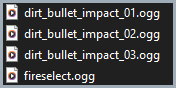

# 🔊 stewbeet.plugins.resource_pack.sounds

📄 **Source Code**: [stewbeet/plugins/resource_pack/sounds/__init__.py](../../python_package/stewbeet/plugins/resource_pack/sounds/__init__.py) 🔗<br>
📄 **Source Code**: [stewbeet/core/utils/sounds.py](../../python_package/stewbeet/core/utils/sounds.py) 🔗<br>

## 📋 Overview
The `sounds` plugin automatically processes sound files and generates the sounds.json configuration for Minecraft resource packs.<br>
It intelligently groups numbered sound variants and handles multithreading for optimal performance.<br>
**(This plugin requires the `sounds_folder` configuration to be set in meta.stewbeet.)**

### <u>Features Showcase</u>

**Example of a sounds folder with .ogg files:**<br>


**Files are copied to resource pack and sounds.json is created:**<br>


## 🎯 Purpose
- 🎵 Processes sound files from a designated sounds folder
- 🔢 Groups numbered sound variants (e.g., sound_01.ogg, sound_02.ogg)
- 📄 Generates sounds.json configuration automatically
- ⚡ Utilizes multithreading for efficient file handling
- 🏷️ Creates appropriate subtitles for sound identification

## 🔗 Dependencies
- **✅ Required**: `sounds_folder` configuration in meta.stewbeet
- **📍 Position**: Should be able to run anywhere in the pipeline<br>
(see [`extensive/beet.yml`](../../templates/extensive/beet.yml) for an example)
- **📂 Assets**: Requires a sounds folder with audio files

## ⚙️ Configuration

### 🎯 Basic Configuration
```yaml
pipeline:
  - ...
  - stewbeet.plugins.resource_pack.sounds
  - ...

meta:
  stewbeet:
    sounds_folder: "assets/sounds"  # Path to sounds directory
```

### 📋 Configuration Options

| Option | Type | Default | Description |
|--------|------|---------|-------------|
| `sounds_folder` | string | **Required** | Path to the directory containing sound files. Must be set in `meta.stewbeet.sounds_folder` |

## ✨ Features

### 🎵 Sound File Processing
- 📁 Recursively scans the sounds folder for audio files
- ✅ Only supports `.ogg` file format for now
- 🧹 Sanitizes filenames (removes spaces, converts to lowercase)
- 📝 Creates Sound objects with proper source paths and subtitles

### 🔢 Numbered Variant Grouping
Automatically groups sound variants with numbered suffixes:
- `dirt_bullet_impact_01.ogg` 🎯
- `dirt_bullet_impact_02.ogg` 🎯  
- `dirt_bullet_impact_03.ogg` 🎯

These become variants of the sound `dirt_bullet_impact` in sounds.json.

**Supported numbering patterns:**
- `name_01`, `name_02`, etc. (with underscore)
- `name1`, `name2`, etc. (without underscore)

### 📄 Sounds.json Generation
- 🔧 Automatically creates or updates sounds.json thanks to the `add_sound` function in [`stewbeet.core.utils.sounds`](../../python_package/stewbeet/core/utils/sounds.py)
- 🏷️ Generates subtitles based on sound names
- 🎛️ Preserves sound properties (volume, pitch, weight, etc.)
- 📍 Uses project namespace for sound references

### ⚡ Multithreading Processing
- 🚀 Processes multiple sound files simultaneously
- 🔧 Automatically optimizes worker count based on file quantity (max 32)
- ⏱️ Includes execution time measurement for performance monitoring

