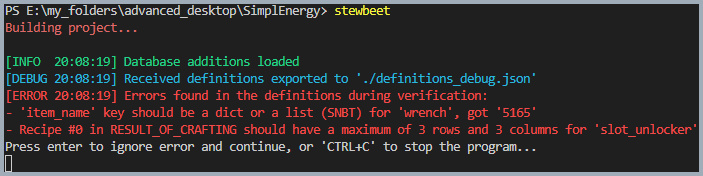

# ✅ stewbeet.plugins.verify_definitions

📄 **Source Code**: [stewbeet/plugins/verify_definitions/__init__.py](../../python_package/stewbeet/plugins/verify_definitions/__init__.py) 🔗

## 📋 Overview
The `verify_definitions` plugin performs comprehensive validation of item definitions to ensure data integrity and consistency across the StewBeet framework.<br>
It validates item configurations, recipe structures, and performs consistency checks before further processing.

### <u>Some Features Showcase</u>

**Export debug information for troubleshooting**<br>


**Detailled error messages**<br>


## 🎯 Purpose
- ✅ Validates all item definitions in `Mem.definitions`
- 🔍 Performs consistency checks on recipe data
- 🚫 Prevents invalid configurations from proceeding
- 📝 Validates text component formats
- 🔧 Ensures custom data integrity
- 🧹 Cleans up empty recipe lists
- 🐛 Exports debug information for troubleshooting

## 🔗 Dependencies
- **✅ Required**: `Your definition plugin` (see [`definitions_setup.md`](../definitions_setup.md) for details)<br>
- **📍 Position**: Should be run immediately after user definitions are loaded<br>
(see [`extensive/beet.yml`](../../templates/extensive/beet.yml) for an example)
- **🔄 Follows**: User definition scripts (e.g., `src.setup_definitions`)

## ⚙️ Configuration

### 🎯 Basic Example Configuration
```yaml
pipeline:
  - stewbeet.plugins.initialize
  - src.setup_definitions  # Your plugin where you define items
  - stewbeet.plugins.verify_definitions  # Must be run after definitions are loaded
  - ...  # Other plugins follow

meta:
  stewbeet:
    definitions_debug: "definitions_debug.json"  # Optional debug export path
```

### 📋 Configuration Options

| Option | Type | Default | Description |
|--------|------|---------|-------------|
| `definitions_debug` | string | `""` | Path where cleaned definitions will be exported for debugging |

## ✨ Features

### 🔍 Core Validation Checks
The plugin performs extensive validation on every item definition:

#### 🆔 Item Structure Validation
- **ID Requirements**: Ensures proper namespaced IDs (e.g., `minecraft:stone`)
- **Reserved Names**: Prevents use of reserved item names like `heavy_workbench`
- **Reserved IDs**: Blocks usage of reserved ID `minecraft:polished_deepslate`
- **Item Name Validation**: Validates text component format for `item_name`
- **Lore Format**: Checks lore text component structure and recommends [Misode's Text Component Generator](https://misode.github.io/text-component/)
- **Category Validation**: Ensures category strings are properly formatted

#### 🧱 Custom Block Validation
- **VANILLA_BLOCK Requirements**: Validates vanilla block configuration for custom blocks
- **Apply Facing Configuration**: Ensures proper `apply_facing` boolean settings
- **Container Restrictions**: Prevents invalid container usage with custom blocks
- **Ore Drop Validation**: Validates `NO_SILK_TOUCH_DROP` configuration for ore blocks

#### 🔒 Custom Data Validation
- **Project Namespace**: Ensures custom data follows project namespace structure
- **Required Format**: Validates `custom_data: {project_id: {item_name: true}}` pattern
- **Data Types**: Ensures proper dictionary structure and boolean values

#### 🍳 Recipe Validation System
Comprehensive recipe validation for all supported types:

##### 🔨 Crafting Recipes
- **`crafting_shaped`**: Validates shape patterns (max 3x3), ingredient mapping, and symbol usage
- **`crafting_shapeless`**: Validates ingredient lists and proper ingredient representation

##### 🔥 Furnace Recipes
- **`smelting`**: Standard furnace recipe validation
- **`blasting`**: Blast furnace recipe validation  
- **`smoking`**: Smoker recipe validation
- **`campfire_cooking`**: Campfire recipe validation
- **Experience & Cooking Time**: Validates numeric values for XP and cooking duration

##### ⚡ Special Recipes
- **`simplenergy_pulverizing`**: SimplEnergy pulverizer compatibility validation

### 🧹 Data Cleanup Operations
- **Empty Recipe Removal**: Automatically removes empty `RESULT_OF_CRAFTING` and `USED_FOR_CRAFTING` lists
- **Override Model Cleanup**: Removes `OVERRIDE_MODEL` keys from debug exports
- **Debug Export**: Optionally exports cleaned definitions to specified path for debugging

### 📝 Error Reporting System
- **Comprehensive Error Collection**: Gathers **all** validation errors before reporting
- **Detailed Error Messages**: Provides specific guidance for fixing each issue
- **Ingredient Validation**: Ensures proper use of `ingr_repr` function for recipe ingredients
- **Format Recommendations**: Suggests proper text component formats and tools

